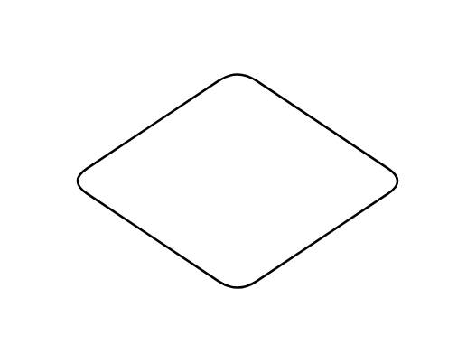

# Choice Pseudo State

## Definition

```js
{
  _style: {
    entity: 'shape=rhombus;html=1;labelPosition=right;align=left;verticalAlign=middle',
  },
  _width: 150,
  _height: 100,
}
```

## Usage

```js
import { ChoicePseudoState } from '@dinghy/standard-components-diagrams/sysmlStateMachines'

<ChoicePseudoState/>
```

## Preview


