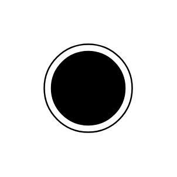

# Final State

## Definition

```js
{
  _style: {
    entity: 'shape=mxgraph.sysml.actFinal;html=1;verticalLabelPosition=bottom;labelBackgroundColor=#ffffff;verticalAlign=top;',
  },
  _original_width: 40,
  _original_height: 40,

}
```

## Usage

```js
import { FinalState } from '@dinghy/standard-components-diagrams/sysmlStateMachines'

<FinalState/>
```

## Preview


