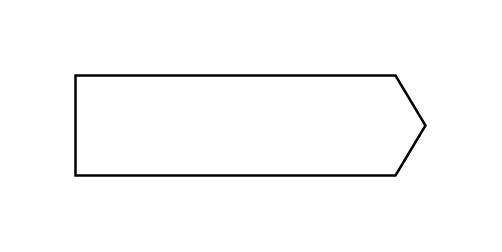

# Send Signal Action

## Definition

```js
{
  _style: {
    entity: 'shape=mxgraph.sysml.sendSigAct;whiteSpace=wrap;align=center;html=1;',
  },
  _width: 140,
  _height: 40,
}
```

## Usage

```js
import { SendSignalAction } from '@dinghy/standard-components-diagrams/sysmlStateMachines'

<SendSignalAction/>
```

## Preview


