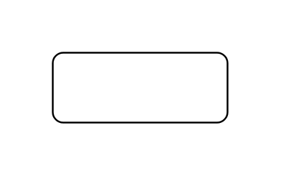

# Simple State

## Definition

```js
{
  _style: {
    entity: 'shape=rect;rounded=1;html=1;whiteSpace=wrap;align=center;',
  },
  _width: 100,
  _height: 40,
}
```

## Usage

```js
import { SimpleState } from '@dinghy/standard-components-diagrams/sysmlStateMachines'

<SimpleState/>
```

## Preview


