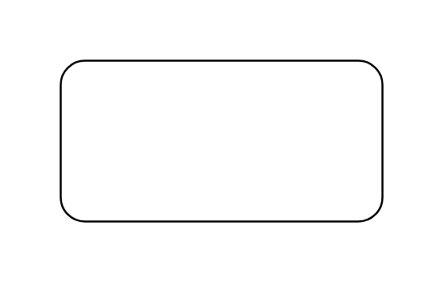

# Stereotype (Node)

## Definition

```js
{
  _style: {
    entity: 'shape=rect;html=1;whiteSpace=wrap;align=center;',
  },
  _width: 160,
  _height: 80,
}
```

## Usage

```js
import { StereotypeNode } from '@dinghy/standard-components-diagrams/sysmlStereotypes'

<StereotypeNode/>
```

## Preview


