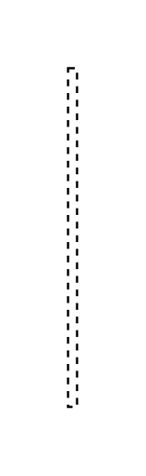

# Stereotype Note 4

## Definition

```js
{
  _style: {
    entity: 'rounded=0;endArrow=none;dashed=1;html=1;',
  },
  _width: 4,
  _height: 150,
}
```

## Usage

```js
import { StereotypeNote4 } from '@dinghy/standard-components-diagrams/sysmlStereotypes'

<StereotypeNote4/>
```

## Preview


