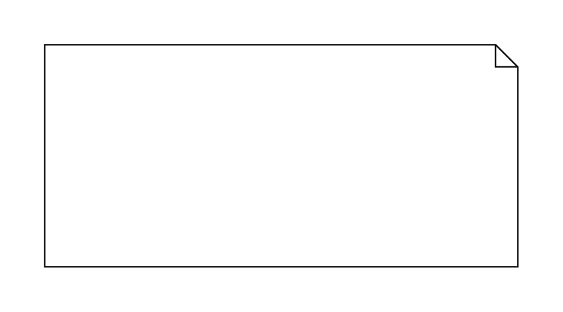

# Stereotype Note

## Definition

```js
{
  _style: {
    entity: 'shape=note;size=15;spacingLeft=5;html=1;overflow=fill;whiteSpace=wrap;',
  },
  _width: 320,
  _height: 150,
}
```

## Usage

```js
import { StereotypeNote } from '@dinghy/standard-components-diagrams/sysmlStereotypes'

<StereotypeNote/>
```

## Preview


