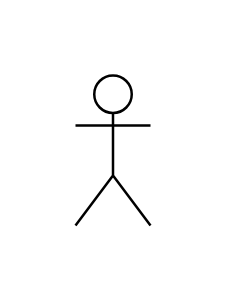

# Actor

## Definition

```js
{
  _style: {
    entity: 'shape=umlActor;html=1;verticalLabelPosition=bottom;verticalAlign=top;align=center;',
  },
  _width: 30,
  _height: 60,
}
```

## Usage

```js
import { Actor } from '@dinghy/standard-components-diagrams/sysmlUsecases'

<Actor/>
```

## Preview


