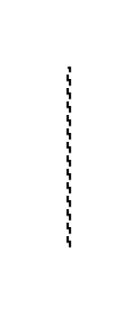

# Extend with Condition 2

## Definition

```js
{
  _style: {
    entity: 'align=right;html=1;verticalAlign=bottom;rounded=0;labelBackgroundColor=none;endArrow=open;endSize=12;dashed=1;',
  },
  _width: 1,
  _height: 80,
}
```

## Usage

```js
import { ExtendWithCondition2 } from '@dinghy/standard-components-diagrams/sysmlUsecases'

<ExtendWithCondition2/>
```

## Preview


