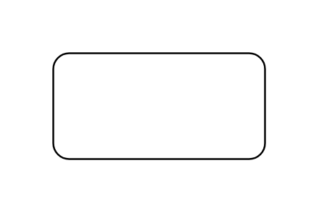

# Subject

## Definition

```js
{
  _style: {
    entity: 'shape=rect;html=1;verticalAlign=top;fontStyle=1;whiteSpace=wrap;align=center;',
  },
  _width: 120,
  _height: 60,
}
```

## Usage

```js
import { Subject } from '@dinghy/standard-components-diagrams/sysmlUsecases'

<Subject/>
```

## Preview


