# Business Value Stream Mapping Entities

- [AirFreight](./air-freight.md)  
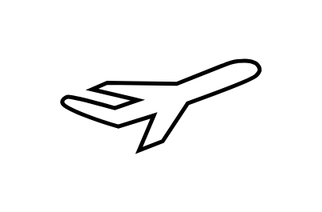

- [BatchedKanban](./batched-kanban.md)  

- [BoatShipment](./boat-shipment.md)  

- [ControlCenter](./control-center.md)  

- [CrossDock](./cross-dock.md)  
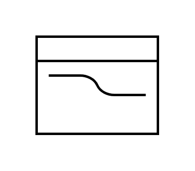

- [CustomerSupplier](./customer-supplier.md)  

- [DataBox](./data-box.md)  
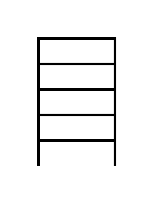

- [DedicatedProcess](./dedicated-process.md)  

- [FifoLane](./fifo-lane.md)  
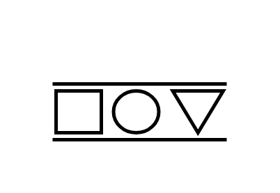

- [FifoSequence](./fifo-sequence.md)  
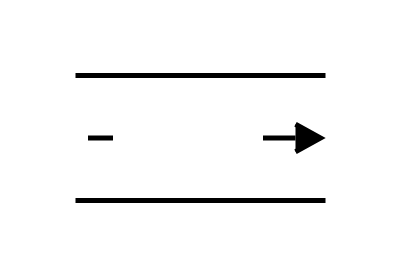

- [GoSeeProductionScheduling](./go-see-production-scheduling.md)  
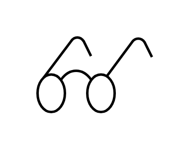

- [InventoryBox](./inventory-box.md)  

- [KaizenLighteningBurst](./kaizen-lightening-burst.md)  

- [KanbanPost](./kanban-post.md)  

- [LoadLeveling](./load-leveling.md)  
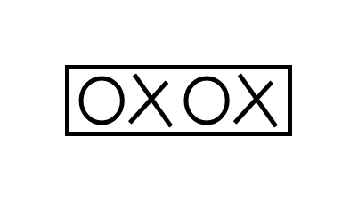

- [MaterialPull](./material-pull.md)  
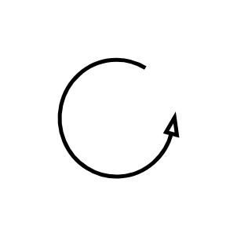

- [MoveByForklift](./move-by-forklift.md)  
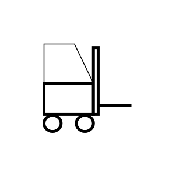

- [MrpErp](./mrp-erp.md)  
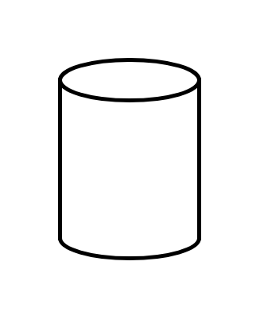

- [Operator](./operator.md)  

- [Orders](./orders.md)  
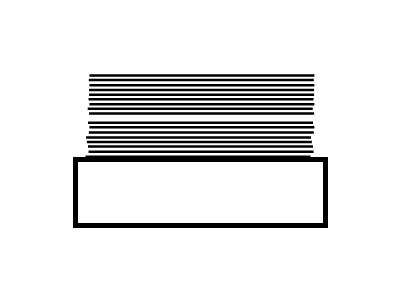

- [ProductionControl](./production-control.md)  

- [ProductionKanban](./production-kanban.md)  
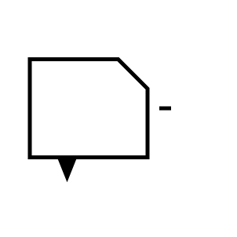

- [PushArrow](./push-arrow.md)  
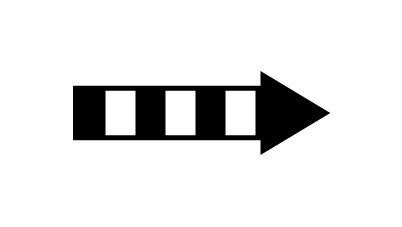

- [QualityProblem](./quality-problem.md)  

- [RailShipment](./rail-shipment.md)  
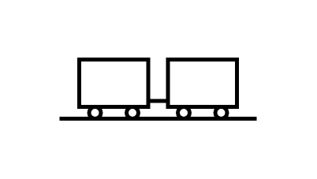

- [SafetyStock](./safety-stock.md)  
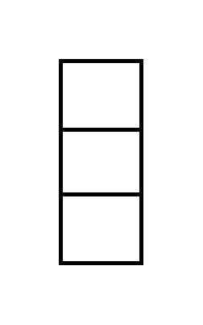

- [SequencedPullBall](./sequenced-pull-ball.md)  

- [SharedProcess](./shared-process.md)  

- [SignalKanban](./signal-kanban.md)  
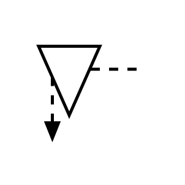

- [Supermarket](./supermarket.md)  

- [Timeline](./timeline.md)  
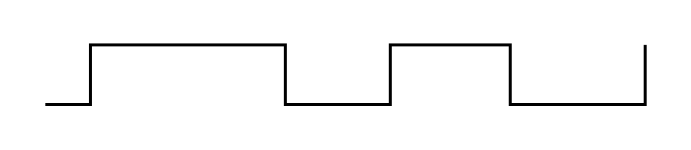

- [TruckShipment](./truck-shipment.md)  

- [VerbalInformation](./verbal-information.md)  
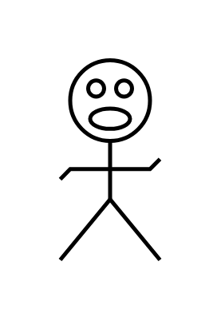

- [Warehouse](./warehouse.md)  

- [WithdrawalKanban](./withdrawal-kanban.md)  
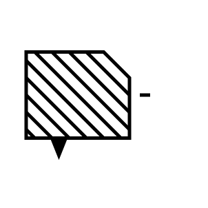

- [Workcell](./workcell.md)  
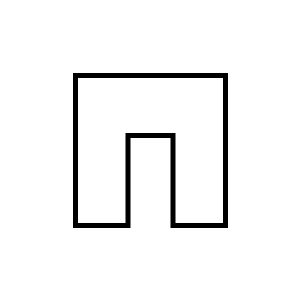
