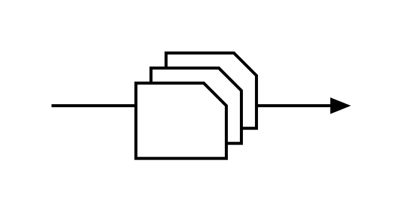

# Batched Kanban

## Definition

```js
{
  _style: {
    entity: 'verticalLabelPosition=bottom;html=1;verticalAlign=top;strokeWidth=2;shape=mxgraph.lean_mapping.batched_kanban;',
  },
  _width: 200,
  _height: 80,
}
```

## Usage

```js
import { BatchedKanban } from '@dinghy/standard-components-diagrams/valueStreamMapping'

<BatchedKanban/>
```

## Preview


