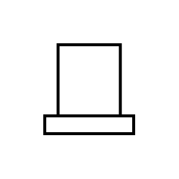

# Control Center

## Definition

```js
{
  _style: {
    entity: 'verticalLabelPosition=bottom;html=1;verticalAlign=top;strokeWidth=2;shape=mxgraph.lean_mapping.control_center;',
  },
  _original_width: 80,
  _original_height: 80,

}
```

## Usage

```js
import { ControlCenter } from '@dinghy/standard-components-diagrams/valueStreamMapping'

<ControlCenter/>
```

## Preview


