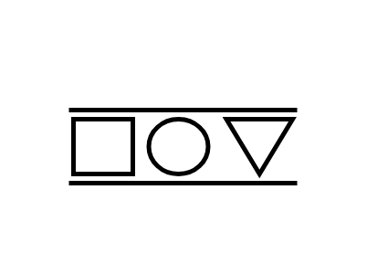

# FIFO Lane

## Definition

```js
{
  _style: {
    entity: 'strokeWidth=2;html=1;shape=mxgraph.lean_mapping.fifo_lane;overflow=fill;verticalAlign=top;align=center;',
  },
  _width: 100,
  _height: 50,
}
```

## Usage

```js
import { FifoLane } from '@dinghy/standard-components-diagrams/valueStreamMapping'

<FifoLane/>
```

## Preview


