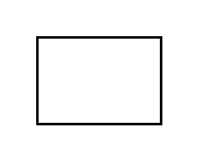

# Production Control

## Definition

```js
{
  _style: {
    entity: 'strokeWidth=2;html=1;shape=mxgraph.lean_mapping.schedule;whiteSpace=wrap;align=center;',
  },
  _width: 100,
  _height: 70,
}
```

## Usage

```js
import { ProductionControl } from '@dinghy/standard-components-diagrams/valueStreamMapping'

<ProductionControl/>
```

## Preview


