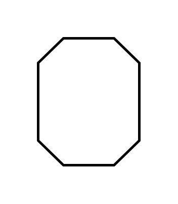

# Quality Problem

## Definition

```js
{
  _style: {
    entity: 'strokeWidth=2;html=1;shape=mxgraph.lean_mapping.quality_problem;fontSize=24;fontStyle=1;whiteSpace=wrap;align=center;',
  },
  _width: 80,
  _height: 100,
}
```

## Usage

```js
import { QualityProblem } from '@dinghy/standard-components-diagrams/valueStreamMapping'

<QualityProblem/>
```

## Preview


