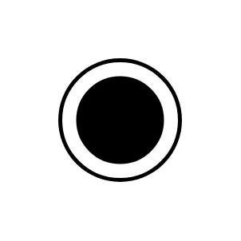

# Sequenced Pull Ball

## Definition

```js
{
  _style: {
    entity: 'verticalLabelPosition=bottom;html=1;verticalAlign=top;strokeWidth=2;shape=mxgraph.lean_mapping.sequenced_pull_ball;',
  },
  _original_width: 60,
  _original_height: 60,

}
```

## Usage

```js
import { SequencedPullBall } from '@dinghy/standard-components-diagrams/valueStreamMapping'

<SequencedPullBall/>
```

## Preview


