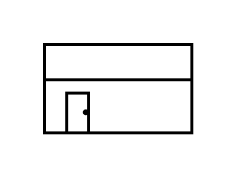

# Warehouse

## Definition

```js
{
  _style: {
    entity: 'verticalLabelPosition=bottom;html=1;verticalAlign=top;strokeWidth=2;shape=mxgraph.lean_mapping.warehouse;',
  },
  _width: 100,
  _height: 60,
}
```

## Usage

```js
import { Warehouse } from '@dinghy/standard-components-diagrams/valueStreamMapping'

<Warehouse/>
```

## Preview


