# Networking Alibaba Cloud Entities

- [AbapBusinessApplicationPlatform](./abap-business-application-platform.md)  

- [AcmsApplicationConfigurationManangement](./acms-application-configuration-manangement.md)  

- [AcrCloudContainerRegistry](./acr-cloud-container-registry.md)  

- [Actiontrail](./actiontrail.md)  

- [AdamAdvancedDatabaseAndApplicationMigration](./adam-advanced-database-and-application-migration.md)  

- [AdbAnalyticdbForMysql](./adb-analyticdb-for-mysql.md)  

- [AddressPurification](./address-purification.md)  

- [AfsFraudService](./afs-fraud-service.md)  

- [AgwAligateway](./agw-aligateway.md)  

- [AhasApplicationHighAvailabilityService](./ahas-application-high-availability-service.md)  
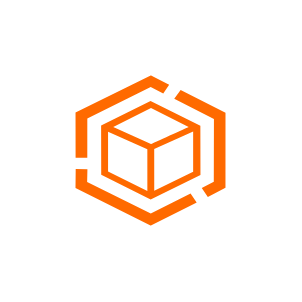

- [AirecArtificialIntelligenceRecommendation](./airec-artificial-intelligence-recommendation.md)  

- [AlbApplicationLoadBalancer](./alb-application-load-balancer.md)  
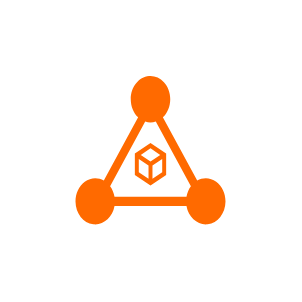

- [AlbApplicationLoadBalancer2](./alb-application-load-balancer-2.md)  
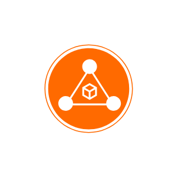

- [AlibabaCloudLogo](./alibaba-cloud-logo.md)  

- [AlibabaCloudLogoChinese](./alibaba-cloud-logo-chinese.md)  

- [AlibabaCloudLogoEnglish](./alibaba-cloud-logo-english.md)  

- [Alimail](./alimail.md)  

- [AlimtMachineTranslation](./alimt-machine-translation.md)  

- [AliyunLinux](./aliyun-linux.md)  

- [AmqpAdvancedMessageQueuingProtocol](./amqp-advanced-message-queuing-protocol.md)  

- [Amscloudapp](./amscloudapp.md)  

- [AnalyticdbForPostgresql](./analyticdb-for-postgresql.md)  

- [Antibot](./antibot.md)  

- [Apigateway](./apigateway.md)  

- [ApsaraFileStorageForHdfs](./apsara-file-storage-for-hdfs.md)  

- [ApsaravideoVod](./apsaravideo-vod.md)  

- [ArmsApplicationRealTimeMonitoringService](./arms-application-real-time-monitoring-service.md)  

- [AskAckContainerServiceForKubernetes](./ask-ack-container-service-for-kubernetes.md)  

- [AsmServiceMesh](./asm-service-mesh.md)  

- [Assettech](./assettech.md)  

- [AvdsVulnerabilityDbScanning](./avds-vulnerability-db-scanning.md)  

- [BaasBlockchainAsAService](./baas-blockchain-as-a-service.md)  

- [BandwidthBag](./bandwidth-bag.md)  

- [Bastionhost](./bastionhost.md)  

- [Batchcompute](./batchcompute.md)  

- [Bccluster](./bccluster.md)  

- [Beebot](./beebot.md)  

- [Beian](./beian.md)  

- [Bizdevops](./bizdevops.md)  

- [Bizworks](./bizworks.md)  

- [Bpstudio](./bpstudio.md)  

- [CasSslCentralAuthenticationService](./cas-ssl-central-authentication-service.md)  

- [CassandraWideColumnDatabase](./cassandra-wide-column-database.md)  

- [CassandraWideColumnDatabase2](./cassandra-wide-column-database-2.md)  

- [CccCloudCallCenter](./ccc-cloud-call-center.md)  

- [CcnCloudConnectNetwork](./ccn-cloud-connect-network.md)  

- [CcsCustomerService](./ccs-customer-service.md)  

- [CcsCustomerService2](./ccs-customer-service-2.md)  

- [CddcCloudDatabaseDedicatedCluster](./cddc-cloud-database-dedicated-cluster.md)  

- [CdnContentDistributionNetwork](./cdn-content-distribution-network.md)  

- [CdpClouderaCdp](./cdp-cloudera-cdp.md)  

- [CdtCloudDatatransfer](./cdt-cloud-datatransfer.md)  

- [CenCloudEnterpriseNetwork](./cen-cloud-enterprise-network.md)  

- [CfwCloudFirewall](./cfw-cloud-firewall.md)  

- [Cityvisual](./cityvisual.md)  
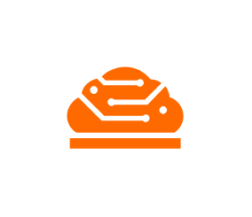

- [ClbClassicLoadBalancer](./clb-classic-load-balancer.md)  
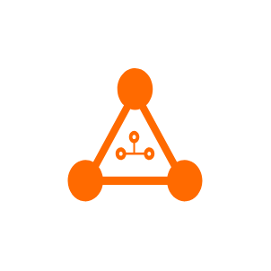

- [ClbClassicLoadBalancer2](./clb-classic-load-balancer-2.md)  

- [Clickhouse](./clickhouse.md)  

- [CloudAuth](./cloud-auth.md)  

- [CloudConfig](./cloud-config.md)  

- [CloudDisplay](./cloud-display.md)  

- [CloudGovernanceCenter](./cloud-governance-center.md)  

- [CloudSecurityCenter](./cloud-security-center.md)  

- [CloudShield](./cloud-shield.md)  

- [Cloudap](./cloudap.md)  

- [Cloudbox](./cloudbox.md)  

- [Clouddesktop](./clouddesktop.md)  

- [Clouddev](./clouddev.md)  

- [Cloudphoto](./cloudphoto.md)  

- [Cloudproc](./cloudproc.md)  

- [Cloudshell](./cloudshell.md)  

- [CmnCloudManagedNetwork](./cmn-cloud-managed-network.md)  

- [CmpCloudMobilePush](./cmp-cloud-mobile-push.md)  

- [CmsCloudMonitorService](./cms-cloud-monitor-service.md)  

- [Codepipeline](./codepipeline.md)  

- [Codestore](./codestore.md)  

- [Companyreg](./companyreg.md)  

- [Computenest](./computenest.md)  

- [ContentSecurity](./content-security.md)  

- [Coo](./coo.md)  

- [CpnsCellPhoneNumberService](./cpns-cell-phone-number-service.md)  

- [CsasCloudSecurityAccessService](./csas-cloud-security-access-service.md)  

- [CvcCloudVideoConferencing](./cvc-cloud-video-conferencing.md)  

- [CwhCloudWebHosting](./cwh-cloud-web-hosting.md)  

- [DasDatabaseAutonomyService](./das-database-autonomy-service.md)  

- [Databot](./databot.md)  

- [Datahub](./datahub.md)  

- [Dataphin](./dataphin.md)  

- [Dataquotient](./dataquotient.md)  

- [Datav](./datav.md)  
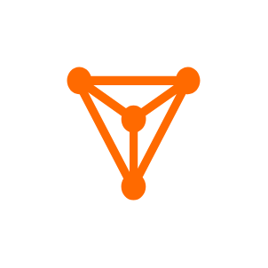

- [DataworksDataide](./dataworks-dataide.md)  

- [Dbaudit](./dbaudit.md)  

- [DbesDatabaseExpertService](./dbes-database-expert-service.md)  

- [DbfsDatabaseFileSystem](./dbfs-database-file-system.md)  

- [DbsDatabaseBackup](./dbs-database-backup.md)  

- [DcdnDynamicRouteForCdn](./dcdn-dynamic-route-for-cdn.md)  

- [DdhDedicatedHost](./ddh-dedicated-host.md)  

- [DdosProtection](./ddos-protection.md)  

- [DdosBgp](./ddos-bgp.md)  

- [DdosDip](./ddos-dip.md)  

- [DdosPro](./ddos-pro.md)  

- [Devops](./devops.md)  

- [DgDatabaseGateway](./dg-database-gateway.md)  

- [Directmail](./directmail.md)  

- [DiskBlockStorage](./disk-block-storage.md)  

- [DlfDataLakeFormation](./dlf-data-lake-formation.md)  

- [DmsDataManagementService](./dms-data-management-service.md)  

- [DnsDomainNameSystem](./dns-domain-name-system.md)  

- [DnsPrivatezone](./dns-privatezone.md)  

- [DnsPrivatezone2](./dns-privatezone-2.md)  

- [Domain](./domain.md)  

- [DomainAndWebsite](./domain-and-website.md)  

- [DrdsDistributeRelationalDatabaseService](./drds-distribute-relational-database-service.md)  

- [DsiDataSecurityInsurance](./dsi-data-security-insurance.md)  

- [DtsDataTransmissionService](./dts-data-transmission-service.md)  

- [EMapreduce](./e-mapreduce.md)  

- [EaisElasticAcceleratedComputingInstances](./eais-elastic-accelerated-computing-instances.md)  

- [EciElasticContainerInstance](./eci-elastic-container-instance.md)  

- [EcsElasticComputeService](./ecs-elastic-compute-service.md)  

- [EdasEnterpriseDistributedApplicationService](./edas-enterprise-distributed-application-service.md)  
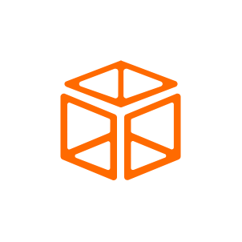

- [EhpcElasticHighPerformanceComputing](./ehpc-elastic-high-performance-computing.md)  

- [EipElasticIpAddress](./eip-elastic-ip-address.md)  

- [ElasticWebHosting](./elastic-web-hosting.md)  

- [Elasticsearch](./elasticsearch.md)  

- [EmasEnterpriseMobileApplicationStudio](./emas-enterprise-mobile-application-studio.md)  

- [Energyexpert](./energyexpert.md)  

- [EnsEdgeNodeService](./ens-edge-node-service.md)  

- [EnterpriseWebsite](./enterprise-website.md)  

- [Eprofile](./eprofile.md)  

- [Esign](./esign.md)  

- [EssElasticScalingService](./ess-elastic-scaling-service.md)  

- [Eventbridge](./eventbridge.md)  

- [ExpressConnect](./express-connect.md)  

- [FaceRecognition](./face-recognition.md)  

- [FcFunctionCompute](./fc-function-compute.md)  

- [FlowService](./flow-service.md)  

- [Flowbag](./flowbag.md)  
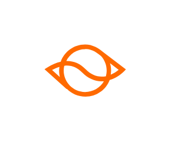

- [FnfServerlessFunctionFlow](./fnf-serverless-function-flow.md)  

- [FpgaFieldProgrammableGateArray](./fpga-field-programmable-gate-array.md)  
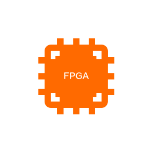

- [FraudDetection](./fraud-detection.md)  

- [GaGlobalAccelerator](./ga-global-accelerator.md)  

- [Gameshield](./gameshield.md)  

- [GdbGraphDatabase](./gdb-graph-database.md)  

- [Graphanalytics](./graphanalytics.md)  

- [Graphcompute](./graphcompute.md)  

- [GtmGlobalTrafficManager](./gtm-global-traffic-manager.md)  

- [GtsGlobalTransactionService](./gts-global-transaction-service.md)  

- [GwsGraphicWorkstation](./gws-graphic-workstation.md)  

- [HavipHighAvailabilityVirtualIpAddress](./havip-high-availability-virtual-ip-address.md)  

- [Hbase](./hbase.md)  

- [HbrHybridBackupRecovery](./hbr-hybrid-backup-recovery.md)  

- [HcsHgwHybridCloudStorageArray](./hcs-hgw-hybrid-cloud-storage-array.md)  

- [HcsMgwHybridCloudStorageDatatransport](./hcs-mgw-hybrid-cloud-storage-datatransport.md)  

- [HcsSgwHybridCloudStorageGateway](./hcs-sgw-hybrid-cloud-storage-gateway.md)  

- [HdrHybridDisasterRecovery](./hdr-hybrid-disaster-recovery.md)  

- [Hologres](./hologres.md)  

- [Holowatcher](./holowatcher.md)  

- [HsmHardwareSecurityModule](./hsm-hardware-security-module.md)  

- [Httpdns](./httpdns.md)  

- [Idrsservice](./idrsservice.md)  

- [ImageRecognition](./image-recognition.md)  

- [Imagesearch](./imagesearch.md)  

- [Imarketing](./imarketing.md)  

- [ImmIntelligentMediaManagement](./imm-intelligent-media-management.md)  

- [ImpIntelligentMediaProduction](./imp-intelligent-media-production.md)  

- [ImpLowCodeVideoFactory](./imp-low-code-video-factory.md)  

- [IndviIndustrialVisualIntelligence](./indvi-industrial-visual-intelligence.md)  

- [IntelligentAdvisor](./intelligent-advisor.md)  

- [IotInternetOfThingsPlatform](./iot-internet-of-things-platform.md)  

- [IotWirelessConnectionService](./iot-wireless-connection-service.md)  

- [IotidIdentity](./iotid-identity.md)  

- [IovIotVehicleCloud](./iov-iot-vehicle-cloud.md)  

- [Ipv6Gateway](./ipv6-gateway.md)  

- [IsocIotSecurityOperationsCenter](./isoc-iot-security-operations-center.md)  

- [IsuIntelligentSemanticUnderstanding](./isu-intelligent-semantic-understanding.md)  

- [Ivision](./ivision.md)  

- [IvpdIntelligentVisualProduction](./ivpd-intelligent-visual-production.md)  

- [Kafka](./kafka.md)  

- [Linkedmall](./linkedmall.md)  

- [Linkwan](./linkwan.md)  

- [Live](./live.md)  

- [Livinglink](./livinglink.md)  

- [LogStreaming](./log-streaming.md)  

- [LogicComposer](./logic-composer.md)  

- [MachineLearning](./machine-learning.md)  

- [ManMobileAnalytics](./man-mobile-analytics.md)  

- [Mariadb](./mariadb.md)  

- [MasMobileAccelerationService](./mas-mobile-acceleration-service.md)  

- [Maxcompute](./maxcompute.md)  

- [Memcache](./memcache.md)  

- [Miniappdev](./miniappdev.md)  
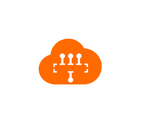

- [MnsMessageService](./mns-message-service.md)  

- [MobileHotfix](./mobile-hotfix.md)  

- [Mobsec](./mobsec.md)  

- [Mongodb](./mongodb.md)  

- [MpsApsaravideoMediaProcessing](./mps-apsaravideo-media-processing.md)  

- [MpsAi](./mps-ai.md)  

- [MpsCensor](./mps-censor.md)  

- [MpsCover](./mps-cover.md)  

- [MpsDna](./mps-dna.md)  

- [MpsMultimod](./mps-multimod.md)  

- [MpsProduce](./mps-produce.md)  

- [MqMessageQueue](./mq-message-queue.md)  

- [MqcMobileQualityCenter](./mqc-mobile-quality-center.md)  

- [MseMicroservicesEngine](./mse-microservices-engine.md)  

- [MultiCloudFinops](./multi-cloud-finops.md)  

- [MultiModeDatabaseLindorm](./multi-mode-database-lindorm.md)  

- [Multimediaai](./multimediaai.md)  

- [Mysql](./mysql.md)  

- [NasNetworkAttachedStorage](./nas-network-attached-storage.md)  

- [NatGateway](./nat-gateway.md)  

- [NetworkAclAccessControlList](./network-acl-access-control-list.md)  

- [NlbNetworkLoadBalancer](./nlb-network-load-balancer.md)  
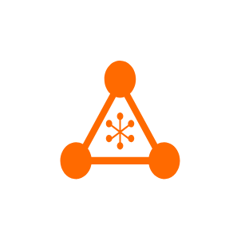

- [NlbNetworkLoadBalancer2](./nlb-network-load-balancer-2.md)  
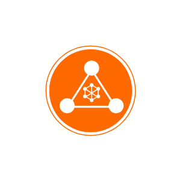

- [NlpNaturalLanguageProcessing](./nlp-natural-language-processing.md)  

- [NlpAddress](./nlp-address.md)  

- [NlpAutoml](./nlp-automl.md)  

- [NlpIeTextInformationExtraction](./nlp-ie-text-information-extraction.md)  

- [NlpKeKeywordExtraction](./nlp-ke-keyword-extraction.md)  

- [NlpNerNamedEntityRecognition](./nlp-ner-named-entity-recognition.md)  

- [NlpPosPartOfSpeechTagging](./nlp-pos-part-of-speech-tagging.md)  

- [NlpRaReflexiveAnaphora](./nlp-ra-reflexive-anaphora.md)  

- [NlpSaSentimentAnalysis](./nlp-sa-sentiment-analysis.md)  

- [NlpTcTextCategorization](./nlp-tc-text-categorization.md)  

- [NlpWsWordSegmentation](./nlp-ws-word-segmentation.md)  

- [Nls](./nls.md)  

- [NlsAsrbag](./nls-asrbag.md)  

- [NlsAsrcustommodel](./nls-asrcustommodel.md)  

- [NlsFilebag](./nls-filebag.md)  

- [NlsService](./nls-service.md)  

- [NlsShortasrbag](./nls-shortasrbag.md)  

- [NlsTtsbag](./nls-ttsbag.md)  

- [NodeJsPerformancePlatform](./node-js-performance-platform.md)  

- [Oceanbase](./oceanbase.md)  

- [OcrOpticalCharacterRecognition](./ocr-optical-character-recognition.md)  

- [OnsmqttMicroMessageQueuingTelemetryTransport](./onsmqtt-micro-message-queuing-telemetry-transport.md)  

- [OosOperationOrchestrationService](./oos-operation-orchestration-service.md)  

- [Openanalytics](./openanalytics.md)  
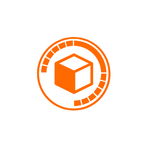

- [OpenapiExplorer](./openapi-explorer.md)  

- [Opensearch](./opensearch.md)  

- [OssObjectStorageService](./oss-object-storage-service.md)  

- [OtsTablestore](./ots-tablestore.md)  

- [Outboundbot](./outboundbot.md)  

- [PcdnP2pCdn](./pcdn-p2p-cdn.md)  

- [PetadataHybriddbForMysql](./petadata-hybriddb-for-mysql.md)  

- [PhysicalConnection](./physical-connection.md)  

- [PnvsPhoneNumberVerificationService](./pnvs-phone-number-verification-service.md)  

- [Polardb](./polardb.md)  

- [PoranaPortraitAnalysis](./porana-portrait-analysis.md)  

- [Postgresql](./postgresql.md)  

- [PpasPayAsYouGoDatabase](./ppas-pay-as-you-go-database.md)  

- [Privatelink](./privatelink.md)  

- [Prometheus](./prometheus.md)  

- [Prophet](./prophet.md)  

- [PtsPerformanceTestService](./pts-performance-test-service.md)  

- [Quickbi](./quickbi.md)  

- [RamResourceAccessManagement](./ram-resource-access-management.md)  

- [ReRecommendationEngine](./re-recommendation-engine.md)  

- [RealtimeCompute](./realtime-compute.md)  

- [RedisKvstore](./redis-kvstore.md)  

- [Region](./region.md)  

- [Retailir](./retailir.md)  

- [RosResourceOrchestrationService](./ros-resource-orchestration-service.md)  

- [RouteTable](./route-table.md)  

- [Router](./router.md)  

- [Rsimganalys](./rsimganalys.md)  

- [RtcRealTimeCommunication](./rtc-real-time-communication.md)  

- [SaeServerlessAppEngine](./sae-serverless-app-engine.md)  

- [SagSmartAccessGateway](./sag-smart-access-gateway.md)  

- [SagSmartAccessGateway2](./sag-smart-access-gateway-2.md)  

- [SasSituationalAwareness](./sas-situational-awareness.md)  

- [ScaSmartConversationAnalysis](./sca-smart-conversation-analysis.md)  

- [ScaSmartConversationAnalysis2](./sca-smart-conversation-analysis-2.md)  

- [SccSuperComputingCluster](./scc-super-computing-cluster.md)  

- [ScdnSecureCdn](./scdn-secure-cdn.md)  

- [ScuStorageCapacityUnit](./scu-storage-capacity-unit.md)  

- [SddpSensitiveDataProtection](./sddp-sensitive-data-protection.md)  
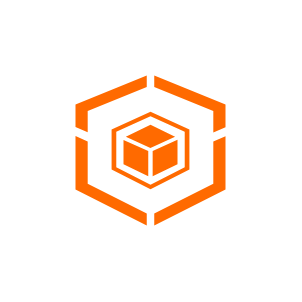

- [SharedBandwidth](./shared-bandwidth.md)  

- [SharedFlowBag](./shared-flow-bag.md)  

- [ShcShieldHybridCloud](./shc-shield-hybrid-cloud.md)  

- [SlbServerLoadBalancer](./slb-server-load-balancer.md)  

- [SlbServerLoadBalancer2](./slb-server-load-balancer-2.md)  

- [SlbServerLoadBalancer3](./slb-server-load-balancer-3.md)  
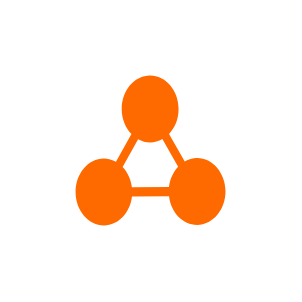

- [SlsSimpleLogService](./sls-simple-log-service.md)  

- [SmcServerMigrationCenter](./smc-server-migration-center.md)  

- [SmsShortMessageService](./sms-short-message-service.md)  

- [Sos](./sos.md)  

- [SparkDataInsights](./spark-data-insights.md)  

- [Sppc](./sppc.md)  

- [Sqlserver](./sqlserver.md)  

- [SwasSimpleApplicationServer](./swas-simple-application-server.md)  

- [TrTransitRouter](./tr-transit-router.md)  

- [TrademarkService](./trademark-service.md)  

- [UisUltimateInternetService](./uis-ultimate-internet-service.md)  

- [User](./user.md)  

- [UserFeedback](./user-feedback.md)  

- [UserFeedback2](./user-feedback-2.md)  

- [VbrVirtualBorderRouter](./vbr-virtual-border-router.md)  

- [VcsVisualComputingService](./vcs-visual-computing-service.md)  

- [VmsVoiceMessagingService](./vms-voice-messaging-service.md)  

- [VoicebotIntelligentVoiceNavigation](./voicebot-intelligent-voice-navigation.md)  

- [VpcVirtualPrivateCloud](./vpc-virtual-private-cloud.md)  
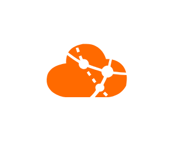

- [VpnGateway](./vpn-gateway.md)  

- [VsVideoSurveillance](./vs-video-surveillance.md)  

- [Vswitch](./vswitch.md)  

- [WafWebApplicationFirewall](./waf-web-application-firewall.md)  

- [WebWebAppService](./web-web-app-service.md)  

- [XdragonBareMetalServer](./xdragon-bare-metal-server.md)  

- [Xtrace](./xtrace.md)  

- [Yida](./yida.md)  

