# Allied Telesis Computer and Terminals Entities

- [IpTv](./ip-tv.md)  
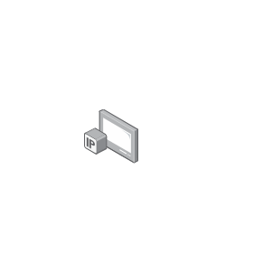

- [Keypad](./keypad.md)  
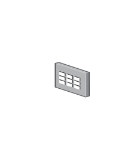

- [Laptop](./laptop.md)  
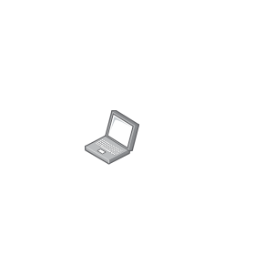

- [PersonalComputer](./personal-computer.md)  
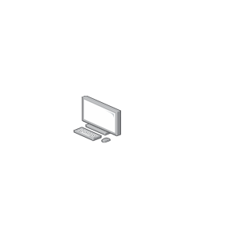

- [PersonalComputerWireless](./personal-computer-wireless.md)  
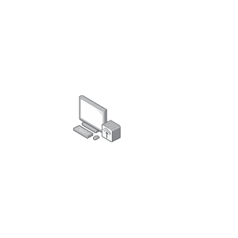

- [PersonalComputerWithServer](./personal-computer-with-server.md)  
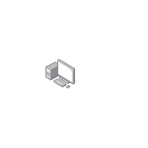

- [PosKeypad](./pos-keypad.md)  
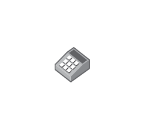

- [PosPrinter](./pos-printer.md)  
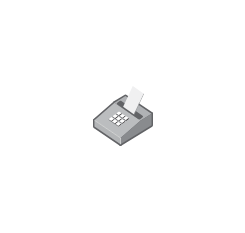

- [ServerDesktop](./server-desktop.md)  
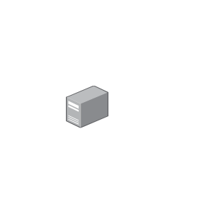

- [Smartphone](./smartphone.md)  
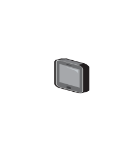

- [Tablet](./tablet.md)  
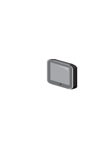

- [TabletAlternative](./tablet-alternative.md)  
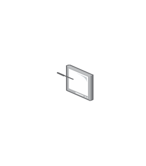

- [VdeoConferenceTerminal](./vdeo-conference-terminal.md)  
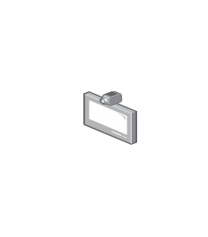

- [VoipIpPhone](./voip-ip-phone.md)  
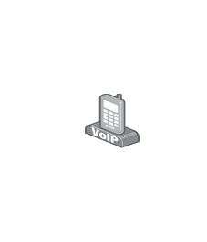
