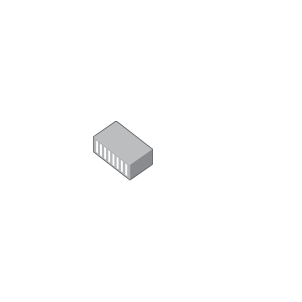

# Media Converter Modular

## Definition

```js
{
  _style: {
    entity: 'image;points=[];aspect=fixed;html=1;align=center;shadow=0;dashed=0;image=img/lib/allied_telesis/media_converters/Media_Converter_Modular.svg;strokeColor=none;',
  },
  _original_width: 70.8,
  _original_height: 54.6,

}
```

## Usage

```js
import { MediaConverterModular } from '@dinghy/standard-components-diagrams/alliedTelesisMediaConverters'

<MediaConverterModular/>
```

## Preview


