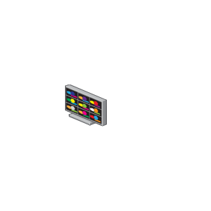

# DVS Surveillance Monitor

## Definition

```js
{
  _style: {
    entity: 'image;points=[];aspect=fixed;html=1;align=center;shadow=0;dashed=0;image=img/lib/allied_telesis/security/DVS_Surveillance_Monitor.svg;strokeColor=none;',
  },
  _original_width: 42,
  _original_height: 60,

}
```

## Usage

```js
import { DvsSurveillanceMonitor } from '@dinghy/standard-components-diagrams/alliedTelesisSecurity'

<DvsSurveillanceMonitor/>
```

## Preview


