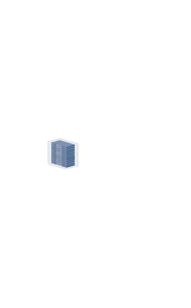
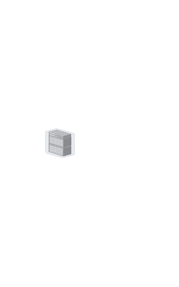
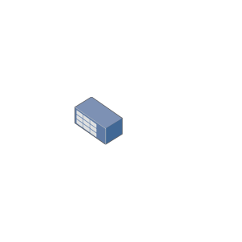
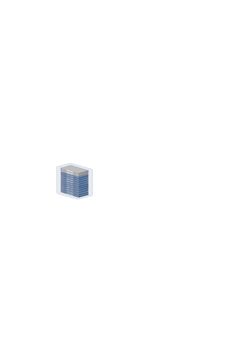
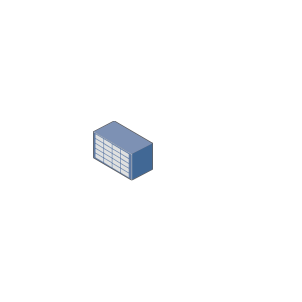

# Allied Telesis Storage Entities

- [DatacenterServerHalfRackTor](./datacenter-server-half-rack-tor.md)  

- [DatacenterServerRack](./datacenter-server-rack.md)  

- [DatacenterServerRackEor](./datacenter-server-rack-eor.md)  

- [DatacenterServerRackStorageUnitSmall](./datacenter-server-rack-storage-unit-small.md)  

- [DatacenterServerRackTor](./datacenter-server-rack-tor.md)  

- [DatacenterServerStorageUnitLarge](./datacenter-server-storage-unit-large.md)  

