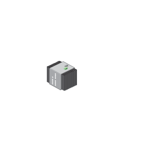

# Industrial_Ethernet_IE300

## Definition

```js
{
  _style: {
    entity: 'image;points=[];aspect=fixed;html=1;align=center;shadow=0;dashed=0;image=img/lib/allied_telesis/switch/Industrial_Ethernet_IE300.svg;strokeColor=none;',
  },
  _original_width: 69.6,
  _original_height: 77.4,

}
```

## Usage

```js
import { IndustrialEthernetIe300 } from '@dinghy/standard-components-diagrams/alliedTelesisSwitch'

<IndustrialEthernetIe300/>
```

## Preview


