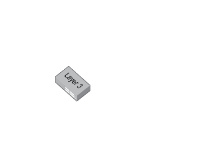

# Switch 24 port L3 Alternative

## Definition

```js
{
  _style: {
    entity: 'image;points=[];aspect=fixed;html=1;align=center;shadow=0;dashed=0;image=img/lib/allied_telesis/switch/Switch_24_port_L3_Alternative.svg;strokeColor=none;',
  },
  _width: 78,
  _height: 52.8,
}
```

## Usage

```js
import { Switch24PortL3Alternative } from '@dinghy/standard-components-diagrams/alliedTelesisSwitch'

<Switch24PortL3Alternative/>
```

## Preview


