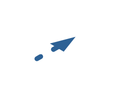

# Dashed Edge

## Definition

```js
{
  _style: {
    entity: 'verticalLabelPosition=bottom;html=1;verticalAlign=top;strokeWidth=1;align=center;outlineConnect=0;dashed=0;outlineConnect=0;shape=mxgraph.aws3d.dashedEdge2;strokeColor=#2D6195;aspect=fixed;',
  },
  _width: 31.6,
  _height: 18,
}
```

## Usage

```js
import { DashedEdge } from '@dinghy/standard-components-diagrams/aws3d'

<DashedEdge/>
```

## Preview


