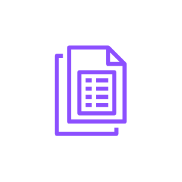

# Quicksight Paginated Reports

## Definition

```js
{
  _style: {
    entity: 'sketch=0;outlineConnect=0;fontColor=#232F3E;gradientColor=none;fillColor=#8C4FFF;strokeColor=none;dashed=0;verticalLabelPosition=bottom;verticalAlign=top;align=center;html=1;fontSize=12;fontStyle=0;aspect=fixed;pointerEvents=1;shape=mxgraph.aws4.quicksight_paginated_reports;',
  },
  _original_width: 62,
  _original_height: 78,

}
```

## Usage

```js
import { QuicksightPaginatedReports } from '@dinghy/standard-components-diagrams/awsAnalytics'

<QuicksightPaginatedReports/>
```

## Preview


