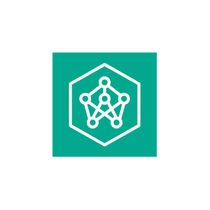
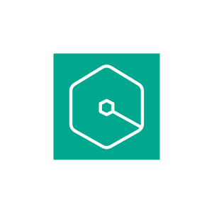

# Aws Artificial Intelligence Entities

- [ApacheMxnetOnAws](./apache-mxnet-on-aws.md)  

- [AppStudio](./app-studio.md)  

- [AugmentedAi](./augmented-ai.md)  

- [Bedrock](./bedrock.md)  

- [Codeguru](./codeguru.md)  

- [Codewhisperer](./codewhisperer.md)  

- [Comprehend](./comprehend.md)  

- [ComprehendMedical](./comprehend-medical.md)  

- [DeepLearningAmis](./deep-learning-amis.md)  

- [DeepLearningContainers](./deep-learning-containers.md)  

- [Deepcomposer](./deepcomposer.md)  

- [Deeplens](./deeplens.md)  

- [Deepracer](./deepracer.md)  

- [DevopsGuru](./devops-guru.md)  

- [DevopsGuruInsights](./devops-guru-insights.md)  

- [ElasticInference](./elastic-inference.md)  

- [Forecast](./forecast.md)  

- [FraudDetector](./fraud-detector.md)  

- [Healthimaging](./healthimaging.md)  

- [Healthlake](./healthlake.md)  

- [Healthomics](./healthomics.md)  

- [Healthscribe](./healthscribe.md)  

- [Kendra](./kendra.md)  

- [Lex](./lex.md)  

- [LookoutForEquipment](./lookout-for-equipment.md)  

- [LookoutForMetrics](./lookout-for-metrics.md)  

- [LookoutForVision](./lookout-for-vision.md)  

- [MachineLearning](./machine-learning.md)  

- [Model](./model.md)  

- [Monitron](./monitron.md)  

- [Neuron](./neuron.md)  

- [Notebook](./notebook.md)  

- [Nova](./nova.md)  

- [Panorama](./panorama.md)  

- [Personalize](./personalize.md)  

- [Polly](./polly.md)  

- [PytorchOnAws](./pytorch-on-aws.md)  

- [Q](./q.md)  

- [Rekognition](./rekognition.md)  

- [RekognitionImage](./rekognition-image.md)  

- [RekognitionVideo](./rekognition-video.md)  

- [SagemakerAi](./sagemaker-ai.md)  

- [SagemakerCanvas](./sagemaker-canvas.md)  

- [SagemakerGeospatialMl](./sagemaker-geospatial-ml.md)  

- [SagemakerGroundTruth](./sagemaker-ground-truth.md)  

- [SagemakerStudioLab](./sagemaker-studio-lab.md)  

- [ShadowTesting](./shadow-testing.md)  

- [TensorflowOnAws](./tensorflow-on-aws.md)  

- [Textract](./textract.md)  

- [TextractAnalyzeLending](./textract-analyze-lending.md)  

- [Train](./train.md)  

- [Transcribe](./transcribe.md)  

- [Translate](./translate.md)  

