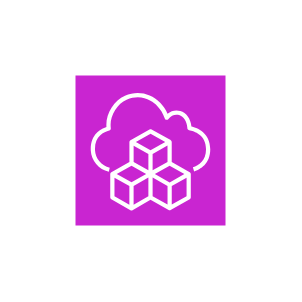
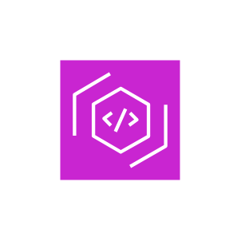
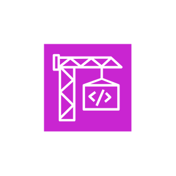
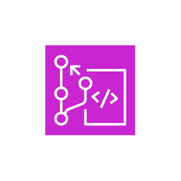
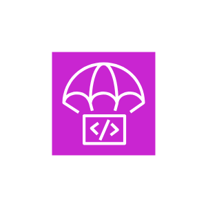
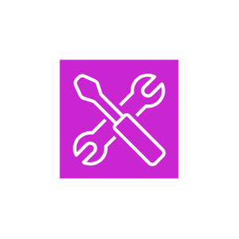
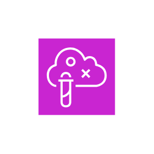
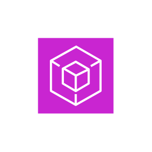

# Aws Developer Tools Entities

- [CloudControlApi](./cloud-control-api.md)  

- [CloudDevelopmentKit](./cloud-development-kit.md)  

- [Cloud9](./cloud9.md)  

- [Cloud92](./cloud9-2.md)  

- [Cloudshell](./cloudshell.md)  

- [Codeartifact](./codeartifact.md)  

- [Codebuild](./codebuild.md)  

- [Codecatalyst](./codecatalyst.md)  

- [Codecommit](./codecommit.md)  

- [Codedeploy](./codedeploy.md)  

- [Codepipeline](./codepipeline.md)  

- [Codestar](./codestar.md)  

- [CommandLineInterface](./command-line-interface.md)  

- [Corretto](./corretto.md)  

- [DeveloperTools](./developer-tools.md)  

- [FaultInjectionService](./fault-injection-service.md)  

- [InfrastructureComposer](./infrastructure-composer.md)  

- [ToolsAndSdks](./tools-and-sdks.md)  

- [XRay](./x-ray.md)  

