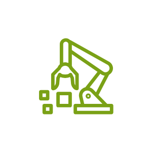

# Aws Internet of Things Entities

- [Component1click](./component-1click.md)  

- [Action](./action.md)  

- [Actuator](./actuator.md)  

- [AlexaSkill](./alexa-skill.md)  

- [AlexaVoiceService](./alexa-voice-service.md)  

- [Analytics](./analytics.md)  

- [Bank](./bank.md)  

- [Button](./button.md)  

- [Bycicle](./bycicle.md)  

- [Camera](./camera.md)  

- [Car](./car.md)  

- [Cart](./cart.md)  

- [Certificate](./certificate.md)  

- [Channel](./channel.md)  

- [CoffeePot](./coffee-pot.md)  

- [Connector](./connector.md)  

- [Core](./core.md)  

- [DataSet](./data-set.md)  

- [DataStore](./data-store.md)  

- [DesiredState](./desired-state.md)  

- [DeviceDefender](./device-defender.md)  

- [DeviceGateway](./device-gateway.md)  

- [DeviceJobs](./device-jobs.md)  

- [DeviceManagement](./device-management.md)  

- [DeviceManagementFleet](./device-management-fleet.md)  

- [DeviceTester](./device-tester.md)  

- [DoorLock](./door-lock.md)  

- [Echo](./echo.md)  

- [Edukit](./edukit.md)  

- [Events](./events.md)  

- [Expresslink](./expresslink.md)  

- [Factory](./factory.md)  

- [FireTv](./fire-tv.md)  

- [FireTvStick](./fire-tv-stick.md)  

- [Fleetwise](./fleetwise.md)  

- [Freertos](./freertos.md)  

- [FreertosDevice](./freertos-device.md)  

- [Generic](./generic.md)  

- [Graph](./graph.md)  

- [Greengrass](./greengrass.md)  

- [GreengrassArtifact](./greengrass-artifact.md)  

- [GreengrassComponent](./greengrass-component.md)  

- [GreengrassComponentMachineLearning](./greengrass-component-machine-learning.md)  

- [GreengrassComponentNucleus](./greengrass-component-nucleus.md)  

- [GreengrassComponentPrivate](./greengrass-component-private.md)  

- [GreengrassComponentPublic](./greengrass-component-public.md)  

- [GreengrassInterprocessCommunication](./greengrass-interprocess-communication.md)  

- [GreengrassProtocol](./greengrass-protocol.md)  

- [GreengrassRecipe](./greengrass-recipe.md)  

- [GreengrassStreamManager](./greengrass-stream-manager.md)  

- [HardwareBoard](./hardware-board.md)  

- [House](./house.md)  

- [HttpProtocol](./http-protocol.md)  

- [Http2Protocol](./http2-protocol.md)  

- [HumiditySensor](./humidity-sensor.md)  

- [IndustrialPc](./industrial-pc.md)  

- [InternetOfThings](./internet-of-things.md)  

- [IotCoreDeviceAdvisor](./iot-core-device-advisor.md)  

- [IotCoreDeviceLocation](./iot-core-device-location.md)  

- [LambdaFunction](./lambda-function.md)  

- [Lightbulb](./lightbulb.md)  

- [LorawanProtocol](./lorawan-protocol.md)  

- [MedicalEmergency](./medical-emergency.md)  

- [MqttProtocol](./mqtt-protocol.md)  

- [Notebook](./notebook.md)  

- [OverTheAirUpdate](./over-the-air-update.md)  

- [Pipeline](./pipeline.md)  

- [Plc](./plc.md)  

- [PoliceEmergency](./police-emergency.md)  

- [Policy](./policy.md)  

- [Relay](./relay.md)  

- [ReportedState](./reported-state.md)  

- [Roborunner](./roborunner.md)  

- [Rule](./rule.md)  

- [Sailboat](./sailboat.md)  

- [Sensor](./sensor.md)  

- [Servo](./servo.md)  

- [Shadow](./shadow.md)  

- [Simulator](./simulator.md)  

- [Sitewise](./sitewise.md)  

- [SitewiseAsset](./sitewise-asset.md)  

- [SitewiseAssetHierarchy](./sitewise-asset-hierarchy.md)  

- [SitewiseAssetModel](./sitewise-asset-model.md)  

- [SitewiseAssetProperties](./sitewise-asset-properties.md)  

- [SitewiseDataStreams](./sitewise-data-streams.md)  

- [Stacklight](./stacklight.md)  

- [TemperatureHumiditySensor](./temperature-humidity-sensor.md)  

- [TemperatureSensor](./temperature-sensor.md)  

- [TemperatureVibrationSensor](./temperature-vibration-sensor.md)  

- [Thermostat](./thermostat.md)  

- [Topic](./topic.md)  

- [Travel](./travel.md)  

- [Twinmaker](./twinmaker.md)  

- [Utility](./utility.md)  

- [VibrationSensor](./vibration-sensor.md)  

- [Windfarm](./windfarm.md)  

