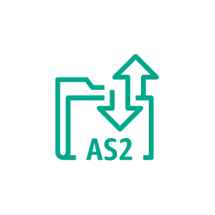

# Aws Migration &amp; Modernization Entities

- [Agent](./agent.md)  

- [AgentlessCollector](./agentless-collector.md)  

- [ApplicationDiscoveryService](./application-discovery-service.md)  

- [ApplicationMigrationService](./application-migration-service.md)  

- [As2](./as2.md)  

- [DataTransferTerminal](./data-transfer-terminal.md)  

- [DatabaseMigrationService](./database-migration-service.md)  

- [Datasync](./datasync.md)  

- [DatasyncDiscovery](./datasync-discovery.md)  

- [DiscoveryAgent](./discovery-agent.md)  

- [ElasticVmwareService](./elastic-vmware-service.md)  

- [Ftp](./ftp.md)  

- [Ftps](./ftps.md)  

- [MainframeModernization](./mainframe-modernization.md)  

- [MainframeModernizationAnalyzer](./mainframe-modernization-analyzer.md)  

- [MainframeModernizationCompiler](./mainframe-modernization-compiler.md)  

- [MainframeModernizationConverter](./mainframe-modernization-converter.md)  

- [MainframeModernizationDeveloper](./mainframe-modernization-developer.md)  

- [MainframeModernizationRuntime](./mainframe-modernization-runtime.md)  

- [MigrationTransfer](./migration-transfer.md)  

- [MigrationEvaluator](./migration-evaluator.md)  

- [MigrationEvaluatorCollector](./migration-evaluator-collector.md)  

- [MigrationHub](./migration-hub.md)  

- [MigrationHubRefactorSpacesApplications](./migration-hub-refactor-spaces-applications.md)  

- [MigrationHubRefactorSpacesEnvironments](./migration-hub-refactor-spaces-environments.md)  

- [MigrationHubRefactorSpacesServices](./migration-hub-refactor-spaces-services.md)  

- [ServerMigrationService](./server-migration-service.md)  

- [Sftp](./sftp.md)  

- [Snowball](./snowball.md)  

- [SnowballEdge](./snowball-edge.md)  

- [Snowmobile](./snowmobile.md)  

- [TransferFamily](./transfer-family.md)  

- [TransferForSftp](./transfer-for-sftp.md)  

