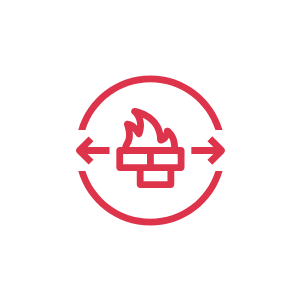
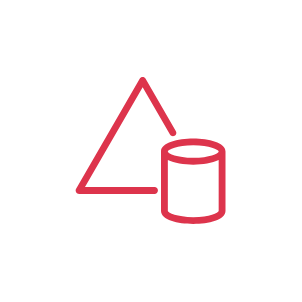

# Aws Security, Identity &amp; Compliance Entities

- [AdConnector](./ad-connector.md)  

- [AddOn](./add-on.md)  

- [Agent](./agent.md)  

- [Artifact](./artifact.md)  

- [AuditManager](./audit-manager.md)  

- [CertificateAuthority](./certificate-authority.md)  

- [CertificateManager](./certificate-manager.md)  

- [CloudDirectory](./cloud-directory.md)  

- [Cloudhsm](./cloudhsm.md)  

- [Cognito](./cognito.md)  

- [DataEncryptionKey](./data-encryption-key.md)  

- [Detective](./detective.md)  

- [DirectoryService](./directory-service.md)  

- [EncryptedData](./encrypted-data.md)  

- [FilteringRule](./filtering-rule.md)  

- [Finding](./finding.md)  

- [FirewallManager](./firewall-manager.md)  

- [Guardduty](./guardduty.md)  

- [IamAccessAnalyzer](./iam-access-analyzer.md)  

- [IamRolesAnywhere](./iam-roles-anywhere.md)  

- [IdentityAccessManagement](./identity-access-management.md)  

- [IdentityCenter](./identity-center.md)  

- [Inspector](./inspector.md)  

- [KeyManagementService](./key-management-service.md)  

- [KeyManagementServiceExternalKeyStore](./key-management-service-external-key-store.md)  

- [LongTermSecurityCredential](./long-term-security-credential.md)  

- [Macie](./macie.md)  

- [ManagedMsAd](./managed-ms-ad.md)  

- [MfaToken](./mfa-token.md)  

- [NetworkFirewall](./network-firewall.md)  

- [NetworkFirewallEndpoints](./network-firewall-endpoints.md)  

- [Organizations](./organizations.md)  

- [OrganizationsAccount](./organizations-account.md)  

- [OrganizationsOrganizationalUnit](./organizations-organizational-unit.md)  

- [PaymentCryptography](./payment-cryptography.md)  

- [Permissions](./permissions.md)  

- [PrivateCertificateAuthority](./private-certificate-authority.md)  

- [ResourceAccessManager](./resource-access-manager.md)  

- [Role](./role.md)  

- [SecretsManager](./secrets-manager.md)  

- [SecurityHub](./security-hub.md)  

- [SecurityIdentityAndCompliance](./security-identity-and-compliance.md)  

- [SecurityIncidentResponse](./security-incident-response.md)  

- [SecurityLake](./security-lake.md)  

- [Shield](./shield.md)  

- [ShieldAdvanced](./shield-advanced.md)  

- [Signer](./signer.md)  

- [SimpleAd](./simple-ad.md)  

- [Sts](./sts.md)  

- [Sts2](./sts-2.md)  

- [TemporarySecurityCredential](./temporary-security-credential.md)  

- [VerifiedPermissions](./verified-permissions.md)  

- [Waf](./waf.md)  

- [WafBadBot](./waf-bad-bot.md)  

- [WafBot](./waf-bot.md)  

- [WafBotControl](./waf-bot-control.md)  

- [WafLabels](./waf-labels.md)  

- [WafManagedRule](./waf-managed-rule.md)  

- [WafRule](./waf-rule.md)  

