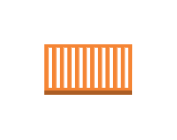

# Aws17 Compute Entities

- [Ami](./ami.md)  

- [Application](./application.md)  

- [ApplicationLoadBalancer](./application-load-balancer.md)  

- [AutoScaling](./auto-scaling.md)  

- [Batch](./batch.md)  

- [ClassicLoadBalancer](./classic-load-balancer.md)  

- [CustomerGateway](./customer-gateway.md)  

- [DbOnInstance](./db-on-instance.md)  

- [Deployment](./deployment.md)  

- [Ec2](./ec2.md)  

- [Ec2ComputeContainer](./ec2-compute-container.md)  

- [Ec2ComputeContainer2](./ec2-compute-container-2.md)  

- [Ec2ComputeContainer3](./ec2-compute-container-3.md)  

- [Ecr](./ecr.md)  

- [EcrRegistry](./ecr-registry.md)  

- [Ecs](./ecs.md)  

- [ElasticBeanstalk](./elastic-beanstalk.md)  

- [ElasticIp](./elastic-ip.md)  

- [ElasticLoadBalancing](./elastic-load-balancing.md)  

- [ElasticNetworkAdapter](./elastic-network-adapter.md)  

- [ElasticNetworkInterface](./elastic-network-interface.md)  

- [Endpoints](./endpoints.md)  

- [FlowLogs](./flow-logs.md)  

- [Instance](./instance.md)  

- [InstanceWithCloudwatch](./instance-with-cloudwatch.md)  

- [Instances](./instances.md)  

- [InternetGateway](./internet-gateway.md)  

- [Lambda](./lambda.md)  

- [LambdaFunction](./lambda-function.md)  

- [Lightsail](./lightsail.md)  

- [NetworkAccessControllist](./network-access-controllist.md)  

- [OptimizedInstance](./optimized-instance.md)  

- [Rescue](./rescue.md)  

- [Router](./router.md)  

- [SpotFleet](./spot-fleet.md)  

- [SpotFleet2](./spot-fleet-2.md)  

- [SpotInstance](./spot-instance.md)  

- [Vpc](./vpc.md)  

- [VpcNatGateway](./vpc-nat-gateway.md)  

- [VpcPeering](./vpc-peering.md)  

- [VpnConnection](./vpn-connection.md)  

- [VpnGateway](./vpn-gateway.md)  

- [X1Instance](./x1-instance.md)  

