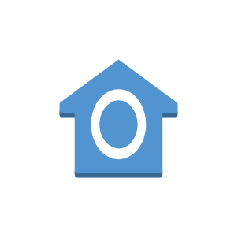
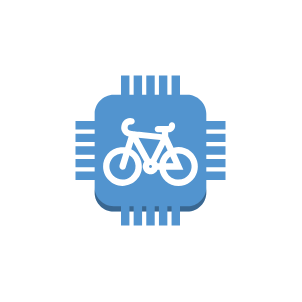
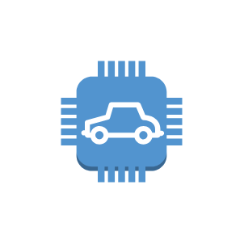
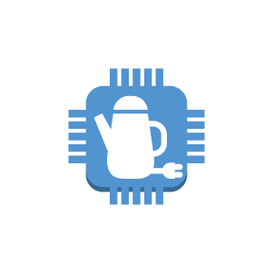
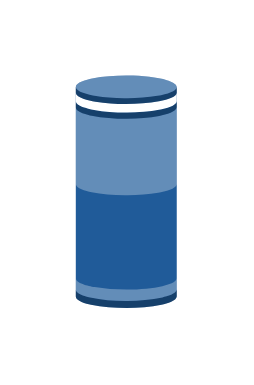
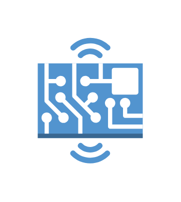
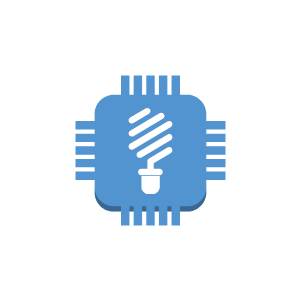
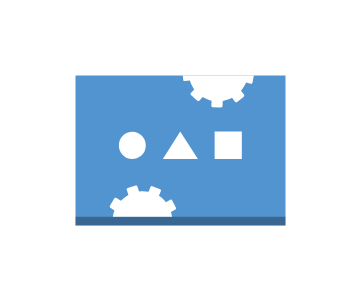
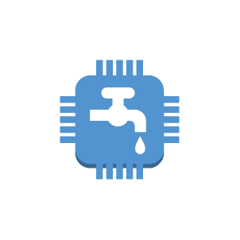
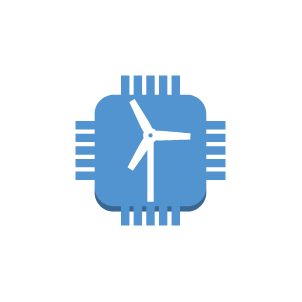

# Aws17 Internet of Things Entities

- [Action](./action.md)  

- [Actuator](./actuator.md)  

- [AlexaEnabledDevice](./alexa-enabled-device.md)  

- [AlexaSkill](./alexa-skill.md)  

- [AlexaSmartHomeSkill](./alexa-smart-home-skill.md)  

- [AlexaVoiceService](./alexa-voice-service.md)  

- [AwsIot](./aws-iot.md)  

- [Bank](./bank.md)  

- [Bicycle](./bicycle.md)  

- [Camera](./camera.md)  

- [Car](./car.md)  

- [Cart](./cart.md)  

- [Certificate](./certificate.md)  

- [CoffeePot](./coffee-pot.md)  

- [DesiredState](./desired-state.md)  

- [DoorLock](./door-lock.md)  

- [Echo](./echo.md)  

- [Factory](./factory.md)  

- [FireTv](./fire-tv.md)  

- [FireTvStick](./fire-tv-stick.md)  

- [Generic](./generic.md)  

- [Greengrass](./greengrass.md)  

- [HardwareBoard](./hardware-board.md)  

- [House](./house.md)  

- [HttpProtocol](./http-protocol.md)  

- [Http2Protocol](./http-2-protocol.md)  

- [LambdaFunction](./lambda-function.md)  

- [Lightbulb](./lightbulb.md)  

- [MedicalEmergency](./medical-emergency.md)  

- [MqttProtocol](./mqtt-protocol.md)  

- [PoliceEmergency](./police-emergency.md)  

- [Policy](./policy.md)  

- [ReportedState](./reported-state.md)  

- [Rule](./rule.md)  

- [Sensor](./sensor.md)  

- [Servo](./servo.md)  

- [Shadow](./shadow.md)  

- [Simulator](./simulator.md)  

- [Thermostat](./thermostat.md)  

- [Topic](./topic.md)  

- [Travel](./travel.md)  

- [Utility](./utility.md)  

- [Windfarm](./windfarm.md)  

