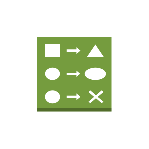

# Change Set

## Definition

```js
{
  _style: {
    entity: 'outlineConnect=0;dashed=0;verticalLabelPosition=bottom;verticalAlign=top;align=center;html=1;shape=mxgraph.aws3.change_set;fillColor=#759C3E;gradientColor=none;',
  },
  _original_width: 55.5,
  _original_height: 64.5,

}
```

## Usage

```js
import { ChangeSet } from '@dinghy/standard-components-diagrams/aws17ManagementTools'

<ChangeSet/>
```

## Preview


