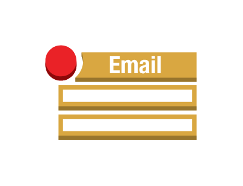
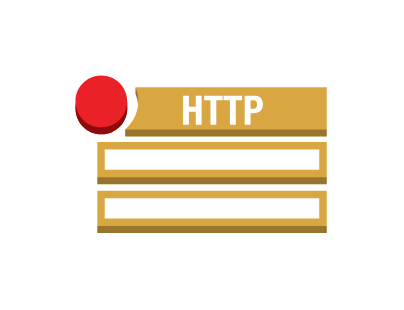
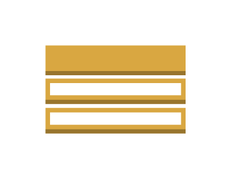

# Aws17 Messaging Entities

- [Email](./email.md)  

- [EmailNotification](./email-notification.md)  

- [HttpNotification](./http-notification.md)  

- [Message](./message.md)  

- [Pinpoint](./pinpoint.md)  

- [Queue](./queue.md)  

- [Ses](./ses.md)  

- [Sns](./sns.md)  

- [Sqs](./sqs.md)  

- [Topic](./topic.md)  

