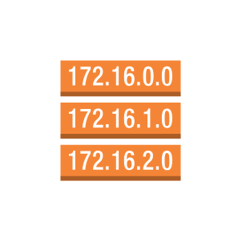

# Aws17 Network and Content Delivery Entities

- [ApplicationLoadBalancer](./application-load-balancer.md)  

- [ClassicLoadBalancer](./classic-load-balancer.md)  

- [Cloudfront](./cloudfront.md)  

- [CustomerGateway](./customer-gateway.md)  

- [DirectConnect](./direct-connect.md)  

- [DownloadDistribution](./download-distribution.md)  

- [EdgeLocation](./edge-location.md)  

- [ElasticLoadBalancing](./elastic-load-balancing.md)  

- [ElasticNetworkAdapter](./elastic-network-adapter.md)  

- [ElasticNetworkInterface](./elastic-network-interface.md)  

- [Endpoints](./endpoints.md)  

- [FlowLogs](./flow-logs.md)  

- [HostedZone](./hosted-zone.md)  

- [InternetGateway](./internet-gateway.md)  

- [NetworkAccessControllist](./network-access-controllist.md)  

- [Route53](./route-53.md)  

- [RouteTable](./route-table.md)  

- [Router](./router.md)  

- [StreamingDistribution](./streaming-distribution.md)  

- [Vpc](./vpc.md)  

- [VpcNatGateway](./vpc-nat-gateway.md)  

- [VpcPeering](./vpc-peering.md)  

- [VpnConnection](./vpn-connection.md)  

- [VpnGateway](./vpn-gateway.md)  

