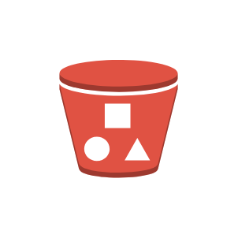

# Bucket with Objects

## Definition

```js
{
  _style: {
    entity: 'outlineConnect=0;dashed=0;verticalLabelPosition=bottom;verticalAlign=top;align=center;html=1;shape=mxgraph.aws3.bucket_with_objects;fillColor=#E05243;gradientColor=none;',
  },
  _original_width: 60,
  _original_height: 61.5,

}
```

## Usage

```js
import { BucketWithObjects } from '@dinghy/standard-components-diagrams/aws17Storage'

<BucketWithObjects/>
```

## Preview


