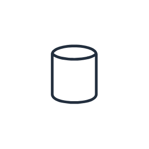
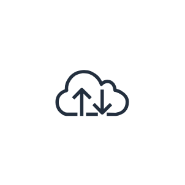
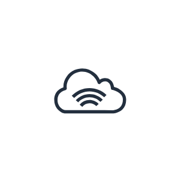
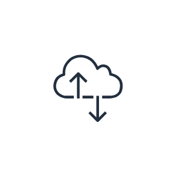
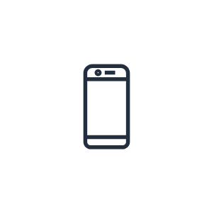
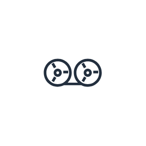

# Aws18 General Resources Entities

- [AwsCloud](./aws-cloud.md)  

- [Client](./client.md)  

- [CorporateDataCenter](./corporate-data-center.md)  

- [Disk](./disk.md)  

- [Forums](./forums.md)  

- [GenericDatabase](./generic-database.md)  

- [Internet](./internet.md)  

- [InternetAlt1](./internet-alt1.md)  

- [InternetAlt2](./internet-alt2.md)  

- [MobileClient](./mobile-client.md)  

- [Multimedia](./multimedia.md)  

- [OfficeBuilding](./office-building.md)  

- [SamlToken](./saml-token.md)  

- [SslPadlock](./ssl-padlock.md)  

- [TapeStorage](./tape-storage.md)  

- [TraditionalServer](./traditional-server.md)  

- [User](./user.md)  

- [Users](./users.md)  

- [VirtualPrivateCloud](./virtual-private-cloud.md)  

