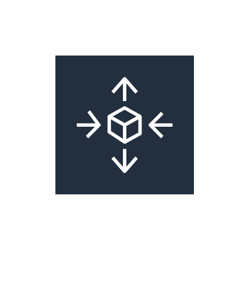
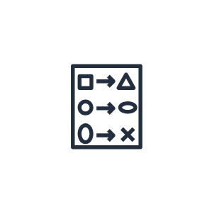
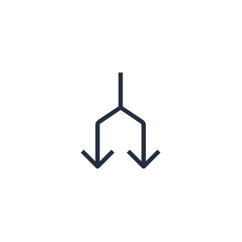
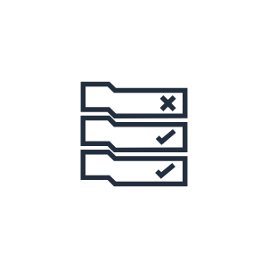

# Aws18 Management Tools Entities

- [Alarm](./alarm.md)  

- [AmazonCloudwatch](./amazon-cloudwatch.md)  

- [Apps](./apps.md)  

- [Automation](./automation.md)  

- [AwsCloudtrail](./aws-cloudtrail.md)  

- [AwsCommandLineInterface](./aws-command-line-interface.md)  

- [AwsAutoScaling](./aws-auto-scaling.md)  

- [AwsCloudformation](./aws-cloudformation.md)  

- [AwsConfig](./aws-config.md)  

- [AwsManagedServices](./aws-managed-services.md)  

- [AwsManagementConsole](./aws-management-console.md)  

- [AwsMarketplace](./aws-marketplace.md)  

- [AwsOpsworks](./aws-opsworks.md)  

- [AwsPersonalHealthDashboard](./aws-personal-health-dashboard.md)  

- [AwsServiceCatalog](./aws-service-catalog.md)  

- [AwsSystemsManager](./aws-systems-manager.md)  

- [AwsTrustedAdvisor](./aws-trusted-advisor.md)  

- [ChangeSet](./change-set.md)  

- [Checklist](./checklist.md)  

- [ChecklistPerformance](./checklist-performance.md)  

- [ChecklistSecurity](./checklist-security.md)  

- [ChecklistCost](./checklist-cost.md)  

- [ChecklistFaultTolerant](./checklist-fault-tolerant.md)  

- [Deployments](./deployments.md)  

- [Documents](./documents.md)  

- [EventEventBased](./event-event-based.md)  

- [EventTimeBased](./event-time-based.md)  

- [Instances](./instances.md)  

- [Inventory](./inventory.md)  

- [Layers](./layers.md)  

- [MaintenanceWindows](./maintenance-windows.md)  

- [Monitoring](./monitoring.md)  

- [ParameterStore](./parameter-store.md)  

- [PatchManager](./patch-manager.md)  

- [Permissions](./permissions.md)  

- [Resources](./resources.md)  

- [Rule](./rule.md)  

- [RunCommand](./run-command.md)  

- [Stack](./stack.md)  

- [Stack2](./stack2.md)  

- [StateManager](./state-manager.md)  

- [Template](./template.md)  

