# Networking Azure Entities

- [AccessControl](./access-control.md)  

- [Automation](./automation.md)  

- [Autoscale](./autoscale.md)  

- [AzureActiveDirectory](./azure-active-directory.md)  

- [AzureAlert](./azure-alert.md)  

- [AzureCache](./azure-cache.md)  
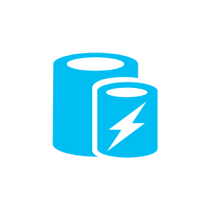

- [AzureInstance](./azure-instance.md)  

- [AzureLoadBalancer](./azure-load-balancer.md)  
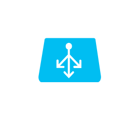

- [AzureMarketplace](./azure-marketplace.md)  

- [AzureSdk](./azure-sdk.md)  
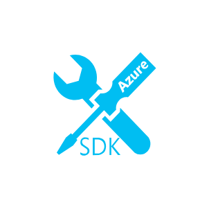

- [AzureSubscription](./azure-subscription.md)  

- [AzureWebsite](./azure-website.md)  

- [BackupService](./backup-service.md)  

- [BitbucketCodeSource](./bitbucket-code-source.md)  

- [BiztalkServices](./biztalk-services.md)  

- [Certificate](./certificate.md)  

- [Cloud](./cloud.md)  

- [CloudService](./cloud-service.md)  

- [CloudServicePackageFile](./cloud-service-package-file.md)  
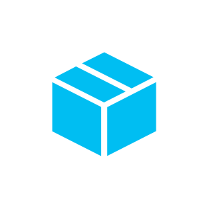

- [CloudServicesConfigurationFile](./cloud-services-configuration-file.md)  

- [CodeFile](./code-file.md)  

- [CodeplexCodeSource](./codeplex-code-source.md)  

- [Computer](./computer.md)  

- [ContentDeliveryNetwork](./content-delivery-network.md)  
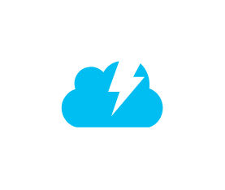

- [Database](./database.md)  
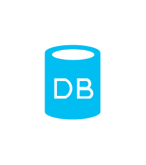

- [DropboxCodeSource](./dropbox-code-source.md)  

- [Enterprise](./enterprise.md)  

- [ExpressRoute](./express-route.md)  
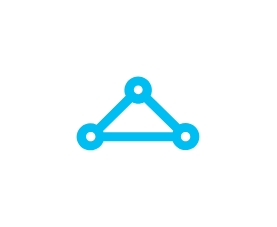

- [File](./file.md)  

- [File2](./file-2.md)  

- [GitRepository](./git-repository.md)  

- [GithubCode](./github-code.md)  

- [Hdinsight](./hdinsight.md)  
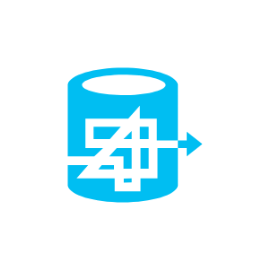

- [HealthMonitoring](./health-monitoring.md)  

- [Healthy](./healthy.md)  

- [HyperVRecoveryManager](./hyper-v-recovery-manager.md)  

- [Laptop](./laptop.md)  

- [LoadBalancerGeneric](./load-balancer-generic.md)  

- [MediaService](./media-service.md)  

- [Message](./message.md)  

- [Mobile](./mobile.md)  

- [MobileServices](./mobile-services.md)  

- [MultiFactorAuthentication](./multi-factor-authentication.md)  

- [MysqlDatabase](./mysql-database.md)  

- [NotificationHub](./notification-hub.md)  

- [NotificationTopic](./notification-topic.md)  

- [OperatingSystemImage](./operating-system-image.md)  

- [PowershellFile](./powershell-file.md)  

- [QueueGeneric](./queue-generic.md)  

- [RdpRemotingFile](./rdp-remoting-file.md)  

- [Scheduler](./scheduler.md)  

- [ScriptFile](./script-file.md)  

- [Server](./server.md)  

- [ServerRack](./server-rack.md)  
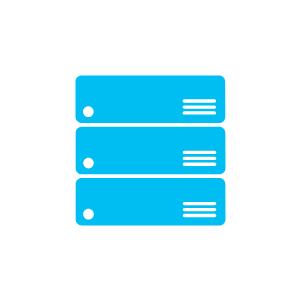

- [ServiceBus](./service-bus.md)  

- [ServiceBusQueues](./service-bus-queues.md)  

- [ServiceBusRelay](./service-bus-relay.md)  

- [ServiceBusTopicsAndSubscriptions](./service-bus-topics-and-subscriptions.md)  

- [ServiceEndpoint](./service-endpoint.md)  

- [SqlDatabase](./sql-database.md)  

- [SqlDatabaseSqlAzure](./sql-database-sql-azure.md)  

- [SqlDatasync](./sql-datasync.md)  

- [SqlReporting](./sql-reporting.md)  

- [StartupTask](./startup-task.md)  

- [Storage](./storage.md)  

- [StorageBlob](./storage-blob.md)  

- [StorageQueue](./storage-queue.md)  

- [StorageTable](./storage-table.md)  

- [Storsimple](./storsimple.md)  

- [Tablet](./tablet.md)  

- [TeamFoundationService](./team-foundation-service.md)  

- [TrafficManager](./traffic-manager.md)  

- [UnidentifiedCodeObject](./unidentified-code-object.md)  

- [User](./user.md)  

- [Vhd](./vhd.md)  

- [VhdDataDisk](./vhd-data-disk.md)  

- [VirtualMachine](./virtual-machine.md)  
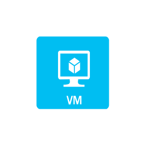

- [VirtualMachineFeature](./virtual-machine-feature.md)  
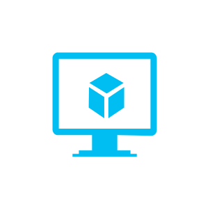

- [VirtualNetwork](./virtual-network.md)  

- [VisualStudioOnline](./visual-studio-online.md)  

- [WadcfgDiagnosticsFile](./wadcfg-diagnostics-file.md)  

- [WebRole](./web-role.md)  

- [WebRoles](./web-roles.md)  

- [WebsiteGeneric](./website-generic.md)  

- [WorkerRole](./worker-role.md)  

- [WorkerRoles](./worker-roles.md)  

