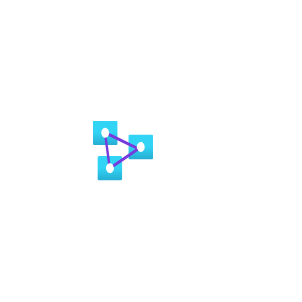
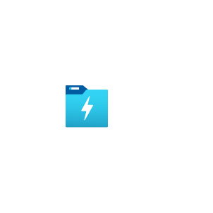
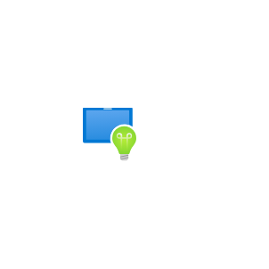

# Azure2 Analytics Entities

- [AnalysisServices](./analysis-services.md)  

- [DataExplorerClusters](./data-explorer-clusters.md)  

- [DataFactories](./data-factories.md)  

- [DataLakeAnalytics](./data-lake-analytics.md)  

- [DataLakeStoreGen1](./data-lake-store-gen1.md)  

- [Databricks](./databricks.md)  

- [EndpointAnalytics](./endpoint-analytics.md)  

- [EventHubClusters](./event-hub-clusters.md)  

- [EventHubs](./event-hubs.md)  

- [HdInsightClusters](./hd-insight-clusters.md)  

- [LogAnalyticsWorkspaces](./log-analytics-workspaces.md)  

- [PowerBiEmbedded](./power-bi-embedded.md)  

- [PowerPlatform](./power-platform.md)  

- [PrivateLinkServices](./private-link-services.md)  

- [StreamAnalyticsJobs](./stream-analytics-jobs.md)  

- [SynapseAnalytics](./synapse-analytics.md)  

- [Workbooks](./workbooks.md)  

