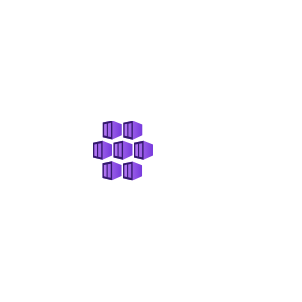
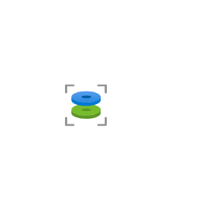
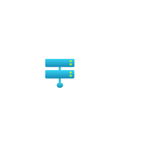
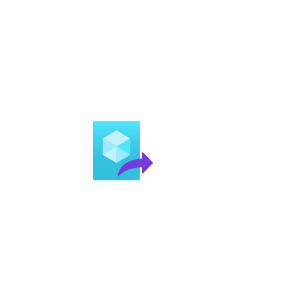
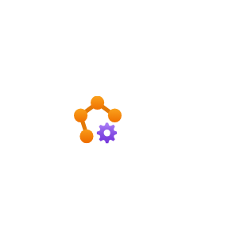

# Azure2 Compute Entities

- [AppServices](./app-services.md)  

- [ApplicationGroup](./application-group.md)  

- [AutomanagedVm](./automanaged-vm.md)  

- [AvailabilitySets](./availability-sets.md)  

- [BatchAccounts](./batch-accounts.md)  

- [CloudServicesClassic](./cloud-services-classic.md)  

- [ComputeGalleries](./compute-galleries.md)  

- [ContainerInstances](./container-instances.md)  

- [ContainerServicesDeprecated](./container-services-deprecated.md)  

- [DiskEncryptionSets](./disk-encryption-sets.md)  

- [Disks](./disks.md)  

- [DisksSnapshots](./disks-snapshots.md)  

- [FunctionApps](./function-apps.md)  

- [HostGroups](./host-groups.md)  

- [HostPools](./host-pools.md)  

- [Hosts](./hosts.md)  

- [ImageDefinitions](./image-definitions.md)  

- [ImageTemplates](./image-templates.md)  

- [ImageVersions](./image-versions.md)  

- [Images](./images.md)  

- [KubernetesServices](./kubernetes-services.md)  

- [MaintenanceConfiguration](./maintenance-configuration.md)  

- [ManagedServiceFabric](./managed-service-fabric.md)  

- [MeshApplications](./mesh-applications.md)  

- [MetricsAdvisor](./metrics-advisor.md)  

- [OsImagesClassic](./os-images-classic.md)  

- [RestorePoints](./restore-points.md)  

- [RestorePointsCollections](./restore-points-collections.md)  

- [ServiceFabricClusters](./service-fabric-clusters.md)  

- [SharedImageGalleries](./shared-image-galleries.md)  

- [SpringCloud](./spring-cloud.md)  

- [VirtualMachine](./virtual-machine.md)  

- [VirtualMachinesClassic](./virtual-machines-classic.md)  

- [VmImagesClassic](./vm-images-classic.md)  

- [VmScaleSets](./vm-scale-sets.md)  

- [Workspaces](./workspaces.md)  

- [Workspaces2](./workspaces-2.md)  

