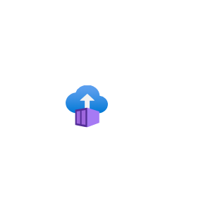
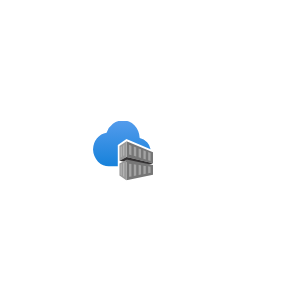
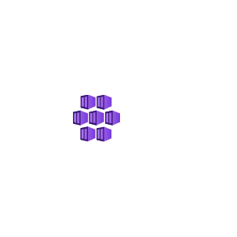

# Azure2 Containers Entities

- [AppServices](./app-services.md)  

- [BatchAccounts](./batch-accounts.md)  

- [ContainerInstances](./container-instances.md)  

- [ContainerRegistries](./container-registries.md)  

- [KubernetesServices](./kubernetes-services.md)  

- [RedHatOpenshift](./red-hat-openshift.md)  

- [ServiceFabricClusters](./service-fabric-clusters.md)  

