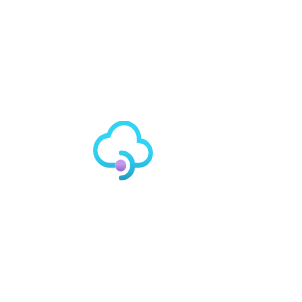
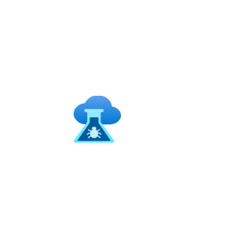
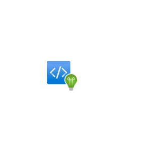
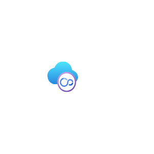
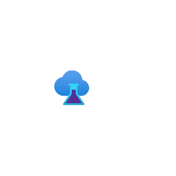
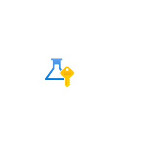
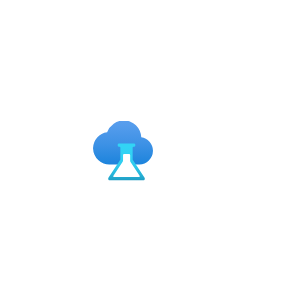

# Azure2 DevOps Entities

- [ApiConnections](./api-connections.md)  

- [ApiManagementServices](./api-management-services.md)  

- [ApplicationInsights](./application-insights.md)  

- [ChangeAnalysis](./change-analysis.md)  

- [Cloudtest](./cloudtest.md)  

- [CodeOptimization](./code-optimization.md)  

- [Devops](./devops.md)  

- [DevopsStarter](./devops-starter.md)  

- [DevtestLabs](./devtest-labs.md)  

- [LabAccounts](./lab-accounts.md)  

- [LabServices](./lab-services.md)  

- [LoadTesting](./load-testing.md)  

