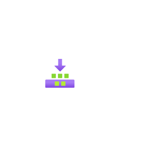
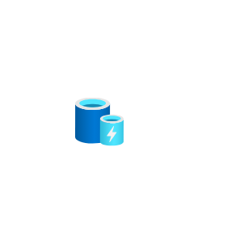
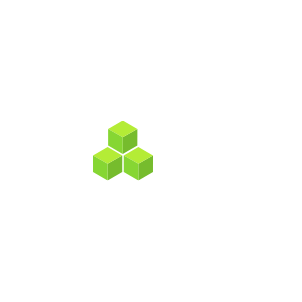
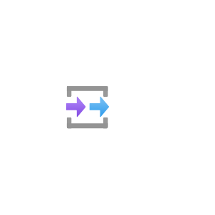
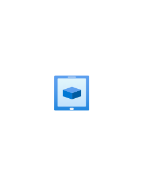
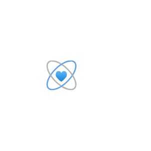
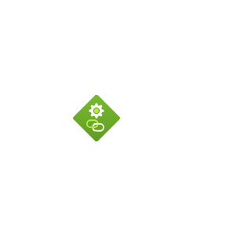
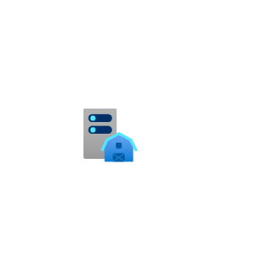
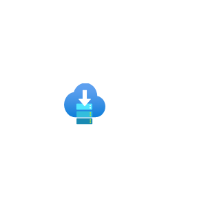

# Azure2 General Entities

- [AllResources](./all-resources.md)  

- [Backlog](./backlog.md)  

- [BizTalk](./biz-talk.md)  

- [BlobBlock](./blob-block.md)  

- [BlobPage](./blob-page.md)  

- [Branch](./branch.md)  

- [Browser](./browser.md)  

- [Bug](./bug.md)  

- [Builds](./builds.md)  

- [Cache](./cache.md)  

- [Code](./code.md)  

- [Commit](./commit.md)  

- [Controls](./controls.md)  

- [ControlsHorizontal](./controls-horizontal.md)  

- [CostAlerts](./cost-alerts.md)  

- [CostAnalysis](./cost-analysis.md)  

- [CostBudgets](./cost-budgets.md)  

- [CostManagement](./cost-management.md)  

- [CostManagementAndBilling](./cost-management-and-billing.md)  

- [Counter](./counter.md)  

- [Cubes](./cubes.md)  

- [Dashboard](./dashboard.md)  

- [Dashboard2](./dashboard-2.md)  

- [DevConsole](./dev-console.md)  

- [Download](./download.md)  

- [Error](./error.md)  

- [Extensions](./extensions.md)  

- [File](./file.md)  

- [Files](./files.md)  

- [FolderBlank](./folder-blank.md)  

- [FolderWebsite](./folder-website.md)  

- [FreeServices](./free-services.md)  

- [Ftp](./ftp.md)  

- [Gear](./gear.md)  

- [Globe](./globe.md)  

- [GlobeError](./globe-error.md)  

- [GlobeSuccess](./globe-success.md)  

- [GlobeWarning](./globe-warning.md)  

- [Guide](./guide.md)  

- [Heart](./heart.md)  

- [HelpAndSupport](./help-and-support.md)  

- [Image](./image.md)  

- [Information](./information.md)  

- [InputOutput](./input-output.md)  

- [JourneyHub](./journey-hub.md)  

- [LaunchPortal](./launch-portal.md)  

- [Learn](./learn.md)  

- [LoadTest](./load-test.md)  

- [Location](./location.md)  

- [LogStreaming](./log-streaming.md)  

- [ManagementGroups](./management-groups.md)  

- [ManagementPortal](./management-portal.md)  

- [Marketplace](./marketplace.md)  

- [MarketplaceManagement](./marketplace-management.md)  

- [Media](./media.md)  

- [MediaFile](./media-file.md)  

- [Mobile](./mobile.md)  

- [MobileEngagement](./mobile-engagement.md)  

- [Module](./module.md)  

- [Power](./power.md)  

- [PowerUp](./power-up.md)  

- [Powershell](./powershell.md)  

- [Preview](./preview.md)  

- [PreviewFeatures](./preview-features.md)  

- [ProcessExplorer](./process-explorer.md)  

- [ProductionReadyDatabase](./production-ready-database.md)  

- [QuickstartCenter](./quickstart-center.md)  

- [Recent](./recent.md)  

- [Reservations](./reservations.md)  

- [ResourceExplorer](./resource-explorer.md)  

- [ResourceGroupList](./resource-group-list.md)  

- [ResourceGroups](./resource-groups.md)  

- [ResourceLinked](./resource-linked.md)  

- [Scale](./scale.md)  

- [Scheduler](./scheduler.md)  

- [Search](./search.md)  

- [SearchGrid](./search-grid.md)  

- [ServerFarm](./server-farm.md)  

- [ServiceBus](./service-bus.md)  

- [ServiceHealth](./service-health.md)  

- [Ssd](./ssd.md)  

- [StorageAzureFiles](./storage-azure-files.md)  

- [StorageContainer](./storage-container.md)  

- [StorageQueue](./storage-queue.md)  

- [Subscriptions](./subscriptions.md)  

- [Table](./table.md)  

- [Tag](./tag.md)  

- [Tags](./tags.md)  

- [Templates](./templates.md)  

- [TfsVcRepository](./tfs-vc-repository.md)  

- [Toolbox](./toolbox.md)  

- [Troubleshoot](./troubleshoot.md)  

- [Versions](./versions.md)  

- [WebSlots](./web-slots.md)  

- [WebTest](./web-test.md)  

- [WebsitePower](./website-power.md)  

- [WebsiteStaging](./website-staging.md)  

- [Workbooks](./workbooks.md)  

- [Workflow](./workflow.md)  

