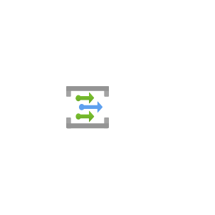
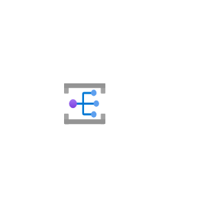
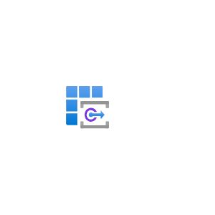
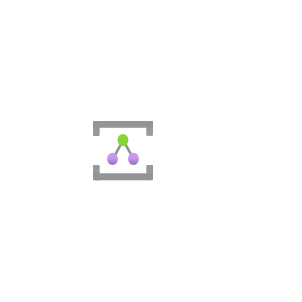
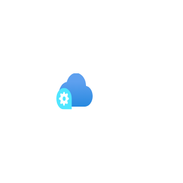
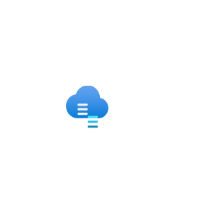
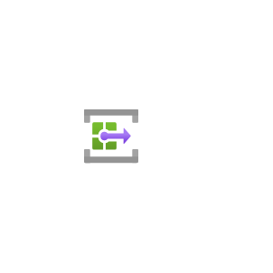

# Azure2 Integration Entities

- [ApiConnections](./api-connections.md)  

- [ApiForFhir](./api-for-fhir.md)  

- [ApiManagementServices](./api-management-services.md)  

- [AppConfiguration](./app-configuration.md)  

- [DataCatalog](./data-catalog.md)  

- [DataFactories](./data-factories.md)  

- [DataboxGateway](./databox-gateway.md)  

- [EventGridDomains](./event-grid-domains.md)  

- [EventGridSubscriptions](./event-grid-subscriptions.md)  

- [EventGridTopics](./event-grid-topics.md)  

- [IntegrationAccounts](./integration-accounts.md)  

- [IntegrationEnvironments](./integration-environments.md)  

- [IntegrationServiceEnvironments](./integration-service-environments.md)  

- [LogicApps](./logic-apps.md)  

- [LogicApps2](./logic-apps-2.md)  

- [LogicAppsCustomConnector](./logic-apps-custom-connector.md)  

- [PartnerNamespace](./partner-namespace.md)  

- [PartnerRegistration](./partner-registration.md)  

- [PartnerTopic](./partner-topic.md)  

- [PowerPlatform](./power-platform.md)  

- [Relays](./relays.md)  

- [SendgridAccounts](./sendgrid-accounts.md)  

- [ServiceBus](./service-bus.md)  

- [SoftwareAsAService](./software-as-a-service.md)  

- [SqlDataWarehouses](./sql-data-warehouses.md)  

- [StackEdge](./stack-edge.md)  

- [StorsimpleDeviceManagers](./storsimple-device-managers.md)  

- [SystemTopic](./system-topic.md)  

