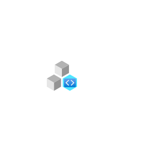

# Azure2 Intune Entities

- [AdRolesAndAdministrators](./ad-roles-and-administrators.md)  

- [ClientApps](./client-apps.md)  

- [DeviceCompliance](./device-compliance.md)  

- [DeviceConfiguration](./device-configuration.md)  

- [DeviceEnrollment](./device-enrollment.md)  

- [DeviceSecurityApple](./device-security-apple.md)  

- [DeviceSecurityGoogle](./device-security-google.md)  

- [DeviceSecurityWindows](./device-security-windows.md)  

- [Devices](./devices.md)  

- [Ebooks](./ebooks.md)  

- [ExchangeAccess](./exchange-access.md)  

- [Intune](./intune.md)  

- [IntuneForEducation](./intune-for-education.md)  

- [Mindaro](./mindaro.md)  

- [SecurityBaselines](./security-baselines.md)  

- [SoftwareUpdates](./software-updates.md)  

- [TenantStatus](./tenant-status.md)  

