# Azure2 IoT Entities

- [CosmosDb](./cosmos-db.md)  

- [DataboxGateway](./databox-gateway.md)  
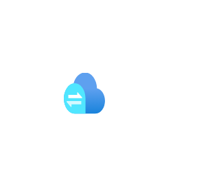

- [DeviceProvisioningServices](./device-provisioning-services.md)  
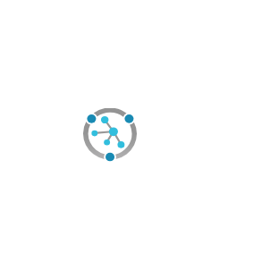

- [DigitalTwins](./digital-twins.md)  
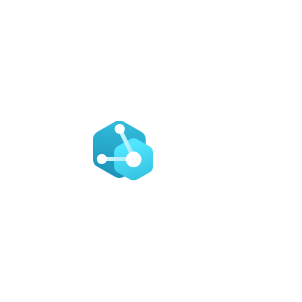

- [EventGridSubscriptions](./event-grid-subscriptions.md)  
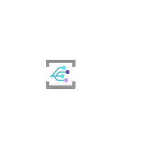

- [EventHubClusters](./event-hub-clusters.md)  
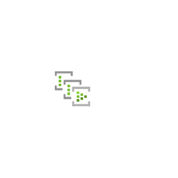

- [EventHubs](./event-hubs.md)  

- [FunctionApps](./function-apps.md)  

- [IndustrialIot](./industrial-iot.md)  
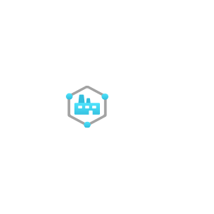

- [IotCentralApplications](./iot-central-applications.md)  
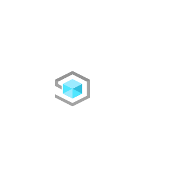

- [IotEdge](./iot-edge.md)  

- [IotHub](./iot-hub.md)  
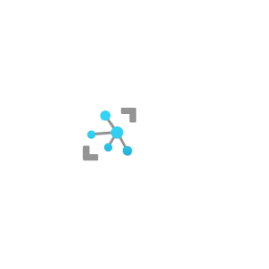

- [IotOperations](./iot-operations.md)  
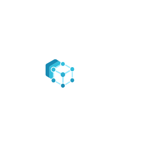

- [LogicApps](./logic-apps.md)  

- [LogicApps2](./logic-apps-2.md)  
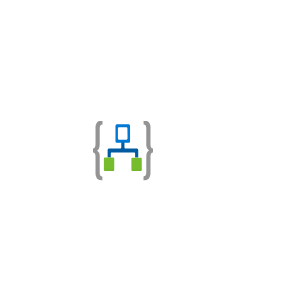

- [MachineLearningStudioClassicWebServices](./machine-learning-studio-classic-web-services.md)  
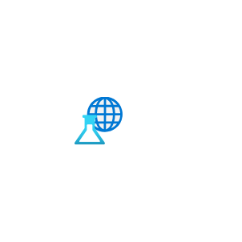

- [MachineLearningStudioWebServicePlans](./machine-learning-studio-web-service-plans.md)  
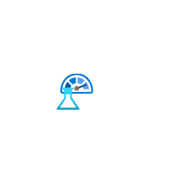

- [MachineLearningStudioWorkspaces](./machine-learning-studio-workspaces.md)  

- [MapsAccounts](./maps-accounts.md)  

- [NotificationHubs](./notification-hubs.md)  

- [Stack](./stack.md)  
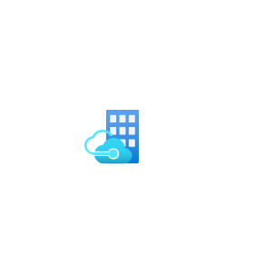

- [StackHciPremium](./stack-hci-premium.md)  
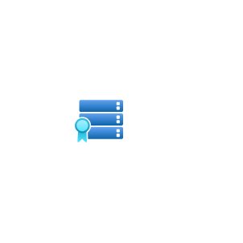

- [StackHciSizer](./stack-hci-sizer.md)  

- [StreamAnalyticsJobs](./stream-analytics-jobs.md)  

- [TimeSeriesDataSets](./time-series-data-sets.md)  

- [TimeSeriesInsightsAccessPolicies](./time-series-insights-access-policies.md)  

- [TimeSeriesInsightsEnvironments](./time-series-insights-environments.md)  

- [TimeSeriesInsightsEventSources](./time-series-insights-event-sources.md)  
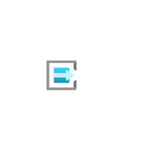

- [Windows10CoreServices](./windows10-core-services.md)  

