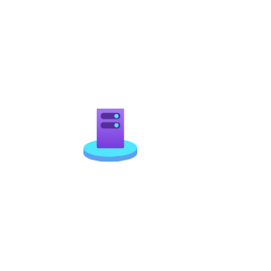
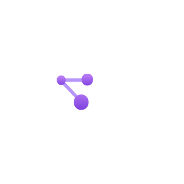
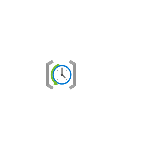
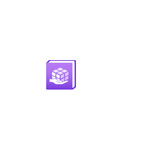
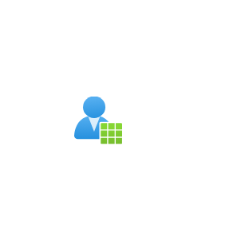

# Azure2 Management and Governance Entities

- [ActivityLog](./activity-log.md)  

- [Advisor](./advisor.md)  

- [Alerts](./alerts.md)  

- [ApplicationInsights](./application-insights.md)  

- [Arc](./arc.md)  

- [ArcMachines](./arc-machines.md)  

- [AutomationAccounts](./automation-accounts.md)  

- [Blueprints](./blueprints.md)  

- [Compliance](./compliance.md)  

- [CostManagementAndBilling](./cost-management-and-billing.md)  

- [CustomerLockboxForMsAzure](./customer-lockbox-for-ms-azure.md)  

- [DiagnosticsSettings](./diagnostics-settings.md)  

- [Education](./education.md)  

- [IntuneTrends](./intune-trends.md)  

- [Lighthouse](./lighthouse.md)  

- [LogAnalyticsWorkspaces](./log-analytics-workspaces.md)  

- [Machinesazurearc](./machinesazurearc.md)  

- [ManagedApplicationsCenter](./managed-applications-center.md)  

- [ManagedDesktop](./managed-desktop.md)  

- [Metrics](./metrics.md)  

- [Monitor](./monitor.md)  

- [MyCustomers](./my-customers.md)  

- [OperationLogClassic](./operation-log-classic.md)  

- [Policy](./policy.md)  

- [RecoveryServicesVaults](./recovery-services-vaults.md)  

- [ResourceGraphExplorer](./resource-graph-explorer.md)  

- [ResourcesProvider](./resources-provider.md)  

- [SchedulerJobCollections](./scheduler-job-collections.md)  

- [ServiceCatalogMad](./service-catalog-mad.md)  

- [ServiceProviders](./service-providers.md)  

- [Solutions](./solutions.md)  

- [UniversalPrint](./universal-print.md)  

- [UserPrivacy](./user-privacy.md)  

